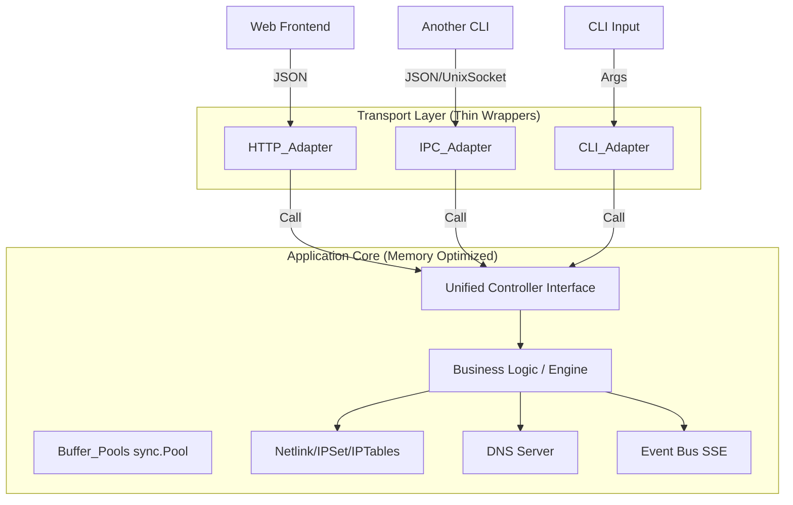

### Project description

**keen-pbr** is a policy-based routing toolkit for Keenetic routers written in Go. It enables selective traffic routing based on IP addresses, CIDR blocks, and domain names using ipset and an internal DNS server.

It’s a CLI + Service + REST API (optional module, can be disabled during compile).

### Rules for planning for keen-pbr

1. I want to implement all by following DRY and KISS principles.
2. I want to reuse SAME functions under the hood for REST API and for CLI API
3. When CLI command should get status of currently-running service, it should perform IPC-call
4. IPC and REST HTTP API handlers must be the same and reusable
5. Never use GIN as HTTP framework. Instead use http server framework from stdlib
6. All functions must be well documented and implement one thing
7. We should focus on reducing CPU and RAM overhead as this app would run on low-end mipsel router with 128mb of ram (15mb is max for our app, the rest for the router itself)
8. Avoid garbage collection if possible. E.g. currently we are using reusable buffers for DNS server handlers.
9. In REST API we have SSE endpoints also
10. If you have any questions ask me prior

### Core Architectural Concept: "The Unified Controller"

The core philosophy of this rewrite is the **Interface-Transport Separation**.
We will remove the concept of "HTTP Handlers" containing business logic. Instead, we define **Controllers** that accept Go structs and return Go structs.

**Architecture Diagram:**



---

### 1. Directory Structure

We will flatten the structure to reduce import cycles and overhead.

```
keen-pbr/
├── cmd/
│   └── keen-pbr/           # Single binary entry point (CLI + Daemon)
├── frontend/               # Frontend is served as static files (if present on device)
├── pkg/
│   ├── api/                # Shared Request/Response Structs (The Contract)
│   ├── controller/         # The Business Logic (Implements the Contract)
│   ├── transport/
│   │   ├── http/           # Standard lib HTTP Server wrapping Controller
│   │   └── ipc/            # Unix Socket Listener wrapping Controller
│   ├── engine/             # Low-level networking (IPSet, Netlink, DNS)
│   ├── config/             # Config loader (optimized)
│   └── pool/               # Memory management (sync.Pool)
└── go.mod

```

---

### 2. The Unified Contract (`pkg/api`)

To ensure IPC and REST use the *exact same* logic, we define the contract using pure Go structs. This is the **only** thing the Logic layer knows about.

```go
package api

// StatusResponse is used by both GET /api/v1/status and `keen-pbr status`
type StatusResponse struct {
    Version    string `json:"version"`
    IsRunning  bool   `json:"is_running"`
    MemUsage   uint64 `json:"mem_usage"`
    Uptime     int64  `json:"uptime"`
}

// IPSetRequest is used by POST /api/v1/ipsets and CLI args
type IPSetRequest struct {
    Name      string   `json:"name"`
    IPs       []string `json:"ips"`
    FlushFirst bool    `json:"flush_first"`
}

```

---

### 3. The Unified Controller (`pkg/controller`)

This is where the magic happens. No HTTP dependencies. No CLI dependencies. Just logic.

```go
package controller

import (
    "context"
    "github.com/maksimkurb/keen-pbr/pkg/api"
    "github.com/maksimkurb/keen-pbr/pkg/engine"
)

// AppController defines the actions available to ALL interfaces (CLI, HTTP, IPC)
type AppController interface {
    GetStatus(ctx context.Context) (*api.StatusResponse, error)
    ApplyIPSet(ctx context.Context, req *api.IPSetRequest) error
    // ... other methods
}

type Service struct {
    network *engine.NetworkManager
    dns     *engine.DNSServer
}

// GetStatus implements the logic ONCE.
// Optimization: Returns pointer to avoid struct copying.
func (s *Service) GetStatus(ctx context.Context) (*api.StatusResponse, error) {
    // Logic to gather status
    return &api.StatusResponse{
        Version: "2.0.0",
        IsRunning: true,
    }, nil
}

```

---

### 4. Zero-Allocation Buffer Pool (`pkg/pool`)

To meet Rule #7 and #8 (Low RAM, avoid GC), we implement a strict buffer pool manager. This is critical for the DNS server and large JSON responses.

```go
package pool

import (
    "bytes"
    "sync"
)

// Global generic byte buffer pool
var bufPool = sync.Pool{
    New: func() any {
        // Pre-allocate 4KB (common MTU/Page size friendly)
        return bytes.NewBuffer(make([]byte, 0, 4096))
    },
}

// Get returns a reset buffer ready for writing
func Get() *bytes.Buffer {
    b := bufPool.Get().(*bytes.Buffer)
    b.Reset()
    return b
}

// Put returns the buffer to the pool
func Put(b *bytes.Buffer) {
    // Optional: Don't put back massive buffers to prevent memory leaks
    if b.Cap() > 65536 {
        return
    }
    bufPool.Put(b)
}

```

---

### 5. Transport Adapters (The Reuse Mechanism)

Here is how we satisfy Rule #4 and #5. We create a generic wrapper that maps the `api` structs to the transport layer.

### A. HTTP Server (Stdlib, No Gin)

```go
package http

import (
    "encoding/json"
    "net/http"
    "github.com/maksimkurb/keen-pbr/pkg/controller"
    "github.com/maksimkurb/keen-pbr/pkg/pool"
)

// Handler wraps the controller
type Server struct {
    ctrl controller.AppController
}

// RegisterRoutes uses Go 1.22+ ServeMux (Pattern Matching)
func (s *Server) RegisterRoutes(mux *http.ServeMux) {
    // Map GET /api/v1/status to the generic handler
    mux.HandleFunc("GET /api/v1/status", s.makeHandler(s.ctrl.GetStatus))
}

// Generic generic wrapper for GET requests
// T is the Response Type
func makeHandler[T any](fn func(context.Context) (T, error)) http.HandlerFunc {
    return func(w http.ResponseWriter, r *http.Request) {
        // Call the reusable logic
        resp, err := fn(r.Context())
        if err != nil {
            http.Error(w, err.Error(), 500)
            return
        }

        // Optimization: Use buffer pool for JSON encoding to reduce GC pressure
        buf := pool.Get()
        defer pool.Put(buf)

        if err := json.NewEncoder(buf).Encode(resp); err != nil {
            http.Error(w, "encoding failed", 500)
            return
        }

        w.Header().Set("Content-Type", "application/json")
        buf.WriteTo(w) // Zero-copy write to network socket
    }
}

```

### B. IPC Server (Unix Socket)

This satisfies Rule #3 and #4. The CLI sends a JSON payload over a socket. The IPC server decodes it and calls the **exact same** `s.ctrl.GetStatus` function used by HTTP.

```go
package ipc

import (
    "encoding/json"
    "net"
    "github.com/maksimkurb/keen-pbr/pkg/controller"
)

// Listen starts a Unix Domain Socket listener
func Listen(socketPath string, ctrl controller.AppController) {
    l, _ := net.Listen("unix", socketPath)
    for {
        conn, _ := l.Accept()
        go handleIPC(conn, ctrl)
    }
}

func handleIPC(conn net.Conn, ctrl controller.AppController) {
    defer conn.Close()

    // Simple protocol: {"command": "status", "payload": {...}}
    var req struct {
        Command string          `json:"command"`
        Payload json.RawMessage `json:"payload"`
    }

    json.NewDecoder(conn).Decode(&req)

    var resp any
    var err error

    // Switch acts as the router
    switch req.Command {
    case "status":
        resp, err = ctrl.GetStatus(context.Background())
    // ... map other commands
    }

    json.NewEncoder(conn).Encode(Response{Data: resp, Error: err})
}

```

---

### 6. The CLI Implementation (IPC vs Direct)

Satisfying Rule #3. When the CLI runs, it determines if it should act as a Client (IPC) or Standalone.

```go
// cmd/keen-pbr/main.go

func main() {
    socketPath := "/tmp/keen-pbr.sock"

    // 1. Check if command is "server" (Daemon mode)
    if os.Args[1] == "service" {
        runDaemon(socketPath)
        return
    }

    // 2. For all other commands, try to connect to IPC
    if isDaemonRunning(socketPath) {
        // IPC Mode: Send command to running daemon
        ipcClient := ipc.NewClient(socketPath)
        ipcClient.SendCommand(os.Args[1], parseArgs())
    } else {
        // Direct Mode: Load config and run logic directly (Reusable logic)
        // This is useful if the daemon is crashed or for "one-off" runs
        cfg := config.Load()
        ctrl := controller.New(cfg) // Same controller!

        switch os.Args[1] {
        case "status":
            resp, _ := ctrl.GetStatus(context.Background())
            printJson(resp)
        }
    }
}

```

---

### 7. SSE Implementation (Optimized)

For the frontend Status/Check widgets. We avoid holding open channels for every client in the logic layer. Instead, use a centralized **Broadcaster**.

1. **Engine**: Pushes events (e.g., `PingResult`) to a global channel `chan any`.
2. **HTTP Layer**:
    - Subscribes to the global channel.
    - Loops and flushes to `http.ResponseWriter`.

This keeps the Logic layer clean of HTTP concepts like `Flusher`.

---

### 8. Optimization Checklist for Low-End Router

1. **Reduce Interface Conversion**: In `engine/`, use concrete types for internal calls (e.g., specific `IPSet` struct) rather than abstract interfaces, unless swapping implementations at runtime is strictly required. The compiler optimizes concrete types better (inline capability).
2. **String Concatenation**: Never use `+` for building large IP lists. Use `strings.Builder` or the `pkg/pool` buffers.
3. **Config Reload**: 
    1. On `SIGHUP` or API config change, do not restart the whole process. Just trigger `ctrl.Reload()`.
4. **DNS Handler**: The DNS handler must use a worker pool pattern or semaphore to limit concurrent requests. 128MB RAM cannot handle 10k goroutines if a flood happens.
    
    ```go
    var semaphore = make(chan struct{}, 50) // Max 50 concurrent DNS lookups
    func (s *DNS) ServeDNS(w dns.ResponseWriter, r *dns.Msg) {
        semaphore <- struct{}{}
        defer func() { <-semaphore }()
        // ... process
    }
    
    ```
    

### Why this is better?

1. **Reusable**: The `controller.AppController` is the single source of truth.
2. **Memory**: `sync.Pool` handles high-throughput endpoints (DNS/Status). No massive framework allocations (Gin/Chi removed).
3. **Maintenance**: CLI and API cannot drift apart because they call the exact same Go function.
4. **Size**: Removing extra libraries and keeping a flat structure reduces binary size (crucial for MIPS storage).
