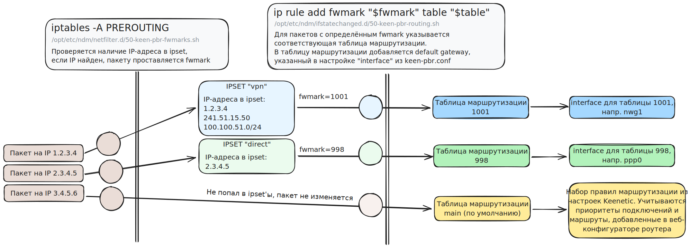
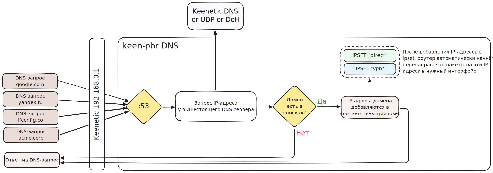

# keen-pbr - Инструменты для выборочной маршрутизации на роутерах Keenetic


> **keen-pbr** не является официальным продуктом компании **Keenetic** и никак с ней не связан. Этот пакет создан сторонним разработчиком и предоставляется "как есть" без какой-либо гарантии, автор не несёт ответственности за повреждение Вашего устройства, все действия Вы выполняете на свой страх и риск.
>
>  Вопросы и предложения касательно пакета можно направлять в [GitHub Issue](https://github.com/maksimkurb/keen-pbr/issues) и в Telegram-чат: https://t.me/keen_pbr.

#### [> README in English <](./README.en.md)

#### ⚠️Для владельцев роутеров Keenetic без USB-разъёма:
* Убедитесь, что вы обновились как минимум до версии `v-1.3.0-2`
* [Отключите автообновление списков](#config-step-3) после установки/обновления пакета

Всё это поможет предотвратить излишний износ NAND-памяти роутера.

---

**keen-pbr** — это пакет для маршрутизации на основе правил для роутеров Keenetic.

Telegram-чат проекта: https://t.me/keen_pbr

С помощью этого пакета можно настроить выборочную маршрутизацию для указанных IP-адресов, подсетей и доменов. Это необходимо, если вам понадобилось организовать защищенный доступ к определенным ресурсам, либо выборочно разделить трафик на несколько провайдеров (напр. трафик до сайта А идёт через одного оператора, а остальной трафик - через другого)

Пакет использует `ipset` для того, чтобы хранить большое количество адресов в памяти роутера без существенного увеличения нагрузки, а также `dnsmasq` для того, чтобы пополнять данный `ipset` IP-адресами, которые резолвят клиенты локальной сети.

Для настройки маршрутизации пакет создает скрипты в директории `/opt/etc/ndm/netfilter.d` и `/opt/etc/ndm/ifstatechanged.d`.

## Особенности

- Маршрутизация на основе доменов через `dnsmasq`
- Маршрутизация на основе IP-адресов через `ipset`
- Настраиваемые таблицы маршрутизации и приоритеты
- Автоматическая настройка для списков `dnsmasq`

## Принцип работы

Данный пакет содержит следующие скрипты и утилиты:
```
/opt
├── /usr
│   └── /bin
│       └── keen-pbr                    # Утилита для скачивания и обработки списков, их импорта в ipset, а также генерации файлов конфигурации для dnsmasq
└── /etc
    ├── /keen-pbr
    │   ├── /keen-pbr.conf              # Файл конфигурации keen-pbr
    │   ├── /lists.d                    # В эту папку keen-pbr будет помещать скачанные и локальные списки. Не кладите сюда ничего сами, т.к. файлы из этой папки удаляются после каждого запуска команды "keen-pbr download".
    │   └── /local.lst                  # Список IP/CIDR/domain по умолчанию
    ├── /ndm
    │   ├── /netfilter.d
    │   │   └── 50-keen-pbr-fwmarks.sh  # Скрипт добавляет iptables правило для маркировки пакетов в ipset с определённым fwmark
    │   └── /ifstatechanged.d
    │       └── 50-keen-pbr-routing.sh  # Скрипт добавляет ip rule для направления пакетов с fwmark в нужную таблицу маршрутизации и создаёт её с нужным default gateway
    ├── /cron.daily
    │   └── 50-keen-pbr-lists-update.sh # Скрипт для автоматического ежедневного обновления списков
    └── /dnsmasq.d
        └── (config files)                  # Папка с сгенерированными конфигурациями для dnsmasq, заставляющими его класть IP-адреса доменов из списков в нужный ipset
```

### Маршрутизация пакетов на основе IP-адресов и подсетей
**keen-pbr** автоматически загружает ip-адреса и подсети из списков в нужные `ipset`. Далее пакеты на IP-адреса, которые попадают в этот `ipset`, маркируются определённым `fwmark` и на основе правил маршрутизации переадресовываются на конкретный интерфейс.

**Схема процесса:**


### Маршрутизация пакетов на основе доменов
Для маршрутизации на основе доменов используется `dnsmasq`. Каждый раз, когда клиенты локальной сети делают DNS-запрос, `dnsmasq` проверяет, есть ли домен в списках, и если есть, то добавляет его ip-адреса в `ipset`.

> [!NOTE]  
> Чтобы маршрутизация доменов работала, клиентские устройства не должны использовать собственные DNS-сервера. Их DNS-сервером должен быть IP роутера, иначе `dnsmasq` не увидит эти пакеты и не добавит ip-адреса в нужный `ipset`.

> [!IMPORTANT]  
> Некоторые приложения и игрушки используют собственные способы получения ip-адресов для своих серверов. Для таких приложений маршрутизация по доменам не будет работать, т.к. эти приложения не делают DNS-запросов. Вам придётся узнавать IP-адреса/подсети серверов этих приложений и добавлять их в списки самостоятельно. 

**Схема процесса:**


## Предварительная подготовка роутера
1. Работоспособность пакета проверялась на **Keenetic OS** версии **4.2.1**. Работоспособность на версии **3.x.x** возможна, но не гарантируется.
2. Необходимо установить дополнительные компоненты на ваш роутер в разделе Управление -> Параметры системы:
   - **Сетевые функции / Протокол IPv6**
     - Этот компонент необходим для возможности установки компонента "Модули ядра подсистемы Netfilter". 
   - **Пакеты OPKG / Поддержка открытых пакетов**
   - **Пакеты OPKG / Модули ядра подсистемы Netfilter**
   - **Пакеты OPKG / Пакет расширения Xtables-addons для Netfilter**
     - На данный момент этот пакет не обязателен, поскольку его возможности не используются keen-pbr, но его возможности могут пригодиться в будущем. Инструкция к модулю [доступна по ссылке](https://manpages.ubuntu.com/manpages/trusty/en/man8/xtables-addons.8.html).
3. Вам необходимо установить среду Entware на Keenetic ([инструкция](https://help.keenetic.com/hc/ru/articles/360021214160-%D0%A3%D1%81%D1%82%D0%B0%D0%BD%D0%BE%D0%B2%D0%BA%D0%B0-%D1%81%D0%B8%D1%81%D1%82%D0%B5%D0%BC%D1%8B-%D0%BF%D0%B0%D0%BA%D0%B5%D1%82%D0%BE%D0%B2-%D1%80%D0%B5%D0%BF%D0%BE%D0%B7%D0%B8%D1%82%D0%BE%D1%80%D0%B8%D1%8F-Entware-%D0%BD%D0%B0-USB-%D0%BD%D0%B0%D0%BA%D0%BE%D0%BF%D0%B8%D1%82%D0%B5%D0%BB%D1%8C)), для этого понадобится USB-накопитель, который будет постоянно вставлен в роутер
4. Также необходимо настроить второе (третье, четвёртое, ...) соединение, через которое вы хотите направить трафик попадающий под списки. Это может быть VPN-соединение или второй провайдер (multi-WAN).
5. **Ваши устройства должны быть в Политике доступа в интернет по умолчанию** (раздел Приоритеты подключений -> Применение политик). В противном случае устройство может игнорировать все правила, применённые keen-pbr.

## Установка и обновление

<details>
<summary><strong>🆕 Обновление с версии 1.x.x на 2.x.x</strong></summary>
В версии 2.0.0 пакет был переименован из `keenetic-pbr` в `keen-pbr`. Поменялись пути к конфигурационным файлам и названия исполняемых файлов.

При обновлении из версии **1.x.x** на **2.x.x** необходимо выполнить следующие действия:

1. Удалите старый пакет:
   ```bash
   opkg remove keenetic-pbr
   ```
2. Переместите конфигурационные файлы в новую папку:
   ```bash
   # Копируем папку keenetic-pbr в keen-pbr 
   cp -r /opt/etc/keenetic-pbr /opt/etc/keen-pbr
   
   # Переименовываем keenetic-pbr.conf в keen-pbr.conf
   mv /opt/etc/keen-pbr/keenetic-pbr.conf /opt/etc/keen-pbr/keen-pbr.conf
   
   # Заменяем пути внутри файла keen-pbr.conf
   sed -i 's|/keenetic-pbr/|/keen-pbr/|g' /opt/etc/keen-pbr/keen-pbr.conf
   ```
3. Следуйте дальнейшим инструкциям по установке с нуля ниже.

---

</details>

1. Установите необходимые зависимости:
   ```bash
   opkg update
   opkg install ca-certificates wget-ssl
   opkg remove wget-nossl
   ```
 
2. Установите opkg-репозиторий в систему
   ```bash
   mkdir -p /opt/etc/opkg
   ARCH=$(opkg print-architecture | grep -v 'all' | awk 'NR==1{print $2}' | cut -d'-' -f1)
   echo "Adding keen-pbr repository for architecture \"${ARCH}\""
   echo "src/gz keen-pbr https://maksimkurb.github.io/keen-pbr/${ARCH}" > /opt/etc/opkg/keen-pbr.conf
   ```
   Поддерживаемые архитектуры: `mips`, `mipsel`, `aarch64`.
 
3. Установите пакет:
   ```bash
   opkg update
   opkg install keen-pbr
   ```

   Во время установки пакет `keen-pbr` заменяет оригинальный файл конфигурации **dnsmasq**.
   Резервная копия будет сохранена в `/opt/etc/dnsmasq.conf.orig`.
   
> [!CAUTION]  
> Если Entware установлен на внутреннюю память роутера, обязательно [отключите автообновление списков](#config-step-3), чтобы предотвратить износ памяти!

#### Обновление:
```bash
opkg update
opkg upgrade keen-pbr
``` 

#### Удаление
```bash
opkg remove --autoremove keen-pbr
```

#### Информация об установленной версии
```bash
opkg info keen-pbr
```

## Настройка

Отредактируйте следующие файлы конфигурации в соответствии с вашими потребностями (подробные инструкции ниже):

1. **(обязательно) [Настройке пакет keen-pbr](#config-step-1)**
    - In this file, you must configure the required ipsets, lists, and output interfaces
2. **(обязательно) [Скачайте удалённые списки (если есть списки с `url="..."`)](#config-step-2)**
3. **(опционально) [Отключите автообновление списков](#config-step-3)**
    - If Entware is installed on internal memory, it is strongly recommended to [disable lists auto-update](#config-step-3) to prevent NAND-flash memory wear
4. **(опционально) [Настройте DNS over HTTPS (DoH)](#config-step-4)**
    - dnsmasq можно перенастроить под свои нужды, например заменить upstream DNS сервер на свой
    - Рекомендуется установить и настроить пакет `dnscrypt-proxy2`, чтобы ваши DNS-запросы были защищены DNS-over-HTTPS (DoH)
5. **(обязательно) [Включение DNS Override](#config-step-5)**

<a name="config-step-1"></a>
### 1. Настройка пакета keen-pbr

Откройте `/opt/etc/keen-pbr/keen-pbr.conf` и отредактируйте его по мере необходимости:

1. Необходимо поправить поле `interfaces`, указав туда интерфейс, через который будет идти исходящий трафик, попавший под критерии списков.
2. Также необходимо добавить списки (локальный или удалённый по URL)

<a name="config-step-2"></a>
### 2. Скачивание удалённых списков

После редактирования конфигурационного файла введите данную команду, чтобы скачать файлы списков.

Эту команду необходимо выполнять только если у Вас есть хотя-бы один удалённый список (поле `url` указано хотя-бы для одного списка).

```bash
keen-pbr download
```

<a name="config-step-3"></a>
### 3. Отключение автообновления списков
> [!CAUTION]
> Если Entware установлен на внутреннюю память роутера, обязательно отключите ежедневное автоматическое обновление списков, чтобы предотвратить износ памяти.
>
> Эту команду нужно выполнять **после каждого обновления пакета keen-pbr**!

Для того, чтобы отключить автообновление списков, удалите файл `/opt/etc/cron.daily/50-keen-pbr-lists-update.sh`:
```bash
rm /opt/etc/cron.daily/50-keen-pbr-lists-update.sh
```

Вы всегда сможете [обновить списки вручную](#lists-update).

<a name="config-step-4"></a>
### 4. Настройка DNS over HTTPS (DoH)
> [!TIP]  
> Обычный протокол DNS является не безопасным, поскольку все запросы передаются в открытом виде.
> Это значит, что провайдер или злоумышленники могут перехватить и подменить ваши DNS-запросы ([DNS spoofing](https://ru.wikipedia.org/wiki/DNS_spoofing)), направив вас на ненастоящий веб-сайт.
> 
> Чтобы обезопасить себя от этого, рекомендуется настроить пакет `dnscrypt-proxy2`, который будет использовать протокол **DNS-over-HTTPS** (**DoH**) для шифрования DNS-запросов.
> Подробнее о **DoH** [можно прочитать здесь](https://adguard-dns.io/ru/blog/adguard-dns-announcement.html).

Для настройки **DoH** на роутере необходимо выполнить следующие действия:
1. Скачиваем `dnscrypt-proxy2`
    ```bash
    opkg install dnscrypt-proxy2
    ```
2. Редактируем файл `/opt/etc/dnscrypt-proxy.toml`
    ```ini
   # ... (здесь другие строчки конфига, их удалять не нужно)
   
   # Указываем upstream-серверы (необходимо убрать решётку перед server_names)
   server_names = ['adguard-dns-doh', 'cloudflare-security', 'google']
   
   # Указываем порт 9153 для прослушивания DNS-запросов
   listen_addresses = ['[::]:9153']
   
   # ... (здесь другие строчки конфига, их удалять не нужно)
    ```
3. Редактируем файл `/opt/etc/dnsmasq.conf`
    ```ini
   # ... (здесь другие строчки конфига, их удалять не нужно)
   
   # Меняем сервер по умолчанию 8.8.8.8 на наш dnscrypt-proxy2
   server=127.0.0.1#9153
   
   # ... (здесь другие строчки конфига, их удалять не нужно)
    ```

4. Проверяем валидность конфигурации
    ```bash
   # Проверяем конфиг dnsmasq
   dnsmasq --test
   # Проверяем конфиг dnscrypt-proxy2 (запускать только если установлен dnscrypt-proxy2)
   dnscrypt-proxy -config /opt/etc/dnscrypt-proxy.toml -check
   ```

<a name="config-step-5"></a>
### 5. Включение DNS Override

Для того, чтобы Keenetic использовал `dnsmasq` в качестве DNS-сервера, необходимо включить **DNS Override**.

> [!NOTE]  
> Данный этап не нужен, если ваши списки содержат только IP-адреса и CIDR и не указывают доменных имён.


1. Откройте следующий URL в браузере: http://my.keenetic.net/a
2. Введите следующие команды по очереди:
   - `opkg dns-override`
   - `system configuration save`
3. Обязательно **перезагрузите роутер**.

> [!TIP]
> Если вы решите отключить DNS-Override в будущем, выполните команды `no opkg dns-override` и `system configuration save`.

### 6. Проверка работы маршрутизации

Убедитесь, что маршрутизация на основе политики работает должным образом.

Для этого откройте адрес, которого нет в ваших списках (напр. https://2ip.ru) и адрес, который есть в ваших списках (напр. https://ifconfig.co) и сравните IP-адреса, они должны быть разными.

<a name="lists-update"></a>
## Обновление списков

* Списки обновляются автоматически ежедневно с помощью `cron`.
  * Если Entware установлен на внутреннюю память, пожалуйста, [отключите автообновление списков](#config-step-3), чтобы предотвратить износ памяти.

В случае, если вы редактировали настройки `keen-pbr.conf` и хотите обновить списки вручную, выполните следующие команды по SSH:

```bash
# Если вы добавили новые удалённые списки, необходимо скачать их
keen-pbr download

# Запустите следующие команды для применения новой конфигурации:
/opt/etc/init.d/S80keen-pbr restart
/opt/etc/init.d/S56dnsmasq restart
```

## Устранение неполадок

Если возникают проблемы, проверьте ваши конфигурационные файлы и логи.
Убедитесь, что списки были загружены правильно, и `dnsmasq` работает с обновленной конфигурацией.

Перед проверкой работоспособности на клиентской машине необходимо очистить DNS-кеш.
Сделать это выполнив команду в консоли (для Windows): `ipconfig /flushdns`.

Также выполните следующую команду, чтобы проверить, правильно ли работает **keen-pbr** (вывод этой команды будет очень полезен, если вы хотите получить помощь в Telegram-чате):
```bash
# Проверка, что dnsmasq запущен корректно
/opt/etc/init.d/S80keen-pbr check

# Проверка состояния маршрутизации
/opt/etc/init.d/S80keen-pbr self-check
```

Вы можете задать вопросы в Telegram-чате проекта: https://t.me/keen_pbr

## Я всё поломал, интернет пропал вовсе

Можно временно отключить данную конфигурацию, выключив **OPKG** в настройках (выбрав раздел="не указан") и перезагрузив роутер.

Если желаете полностью удалить пакет, необходимо выполнить следующие шаги:
1. По SSH выполнить: `opkg remove keen-pbr dnsmasq dnscrypt-proxy2`
2. Отключить DNS-override (http://my.keenetic.net/a):
    - `no opkg dns-override`
    - `system configuration save`
3. Выключить **OPKG** (если не пользуетесь им для других нужд)
4. Перезагрузить роутер

### Полное удаление пакета

1. По SSH выполнить: `opkg remove keen-pbr dnsmasq dnscrypt-proxy2`
2. Отключить DNS-override (http://my.keenetic.net/a):
    - `no opkg dns-override`
    - `system configuration save`
3. Выключить **OPKG** (если не пользуетесь им для других нужд)
4. Перезагрузить роутер

---

Приятного использования маршрутизации на основе политики с **keen-pbr**!
