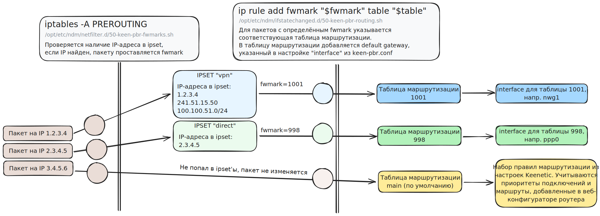
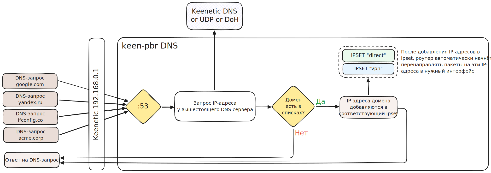

# keen-pbr - Инструменты для выборочной маршрутизации на роутерах Keenetic


[](https://t.me/keen_pbr)

> **keen-pbr** не является официальным продуктом компании **Keenetic** и никак с ней не связан. Этот пакет создан сторонним разработчиком и предоставляется "как есть" без какой-либо гарантии, автор не несёт ответственности за повреждение Вашего устройства, все действия Вы выполняете на свой страх и риск.
>
>  Вопросы и предложения касательно пакета можно направлять в [GitHub Issue](https://github.com/maksimkurb/keen-pbr/issues) и в Telegram-чат: https://t.me/keen_pbr.

#### [> :us: README in English <](./README.en.md)

#### Поддержите проект 💰
> [-lightgreen?logo=ko-fi&logoColor=FF6433&labelColor=white)](https://ko-fi.com/keen_pbr) <br>
> [-lightgreen?logo=data%3Aimage%2Fsvg%2Bxml%3Bbase64%2CPD94bWwgdmVyc2lvbj0iMS4wIiBlbmNvZGluZz0iVVRGLTgiPz4KPHN2ZyBmaWxsPSJub25lIiB2aWV3Qm94PSIwIDAgMjY2LjE4IDI2Ni4xOCIgeG1sbnM9Imh0dHA6Ly93d3cudzMub3JnLzIwMDAvc3ZnIj4KPGcgY2xpcC1wYXRoPSJ1cmwoI2EpIj4KPHBhdGggZD0iTTEzMy4wOSAyNjYuMThDMjA2LjU5NCAyNjYuMTggMjY2LjE4IDIwNi41OTQgMjY2LjE4IDEzMy4wOUMyNjYuMTggNTkuNTg2NCAyMDYuNTk0IDAgMTMzLjA5IDBDNTkuNTg2NCAwIDAgNTkuNTg2NCAwIDEzMy4wOUMwIDIwNi41OTQgNTkuNTg2NCAyNjYuMTggMTMzLjA5IDI2Ni4xOFoiIGZpbGw9IiM2NDk2REMiLz4KPHBhdGggZD0ibTEwNC41IDE3MC4zIDg2LjE5LTg2LjE5YzIuMTMxLTIuMTMyOCA0LjY2MS0zLjgyNDkgNy40NDUtNC45NzkzIDIuNzg1LTEuMTU0NCA1Ljc3LTEuNzQ4NiA4Ljc4NS0xLjc0ODZzNiAwLjU5NDIgOC43ODUgMS43NDg2YzIuNzg0IDEuMTU0NCA1LjMxNCAyLjg0NjUgNy40NDUgNC45NzkzIDIuMTMzIDIuMTMwNSAzLjgyNSA0LjY2MDUgNC45NzkgNy40NDU0IDEuMTU1IDIuNzg0OSAxLjc0OSA1Ljc3IDEuNzQ5IDguNzg0NiAwIDMuMDE1LTAuNTk0IDYtMS43NDkgOC43ODUtMS4xNTQgMi43ODUtMi44NDYgNS4zMTUtNC45NzkgNy40NDVsLTUzLjY1IDUzLjczYy04LjYyNCA4LjYxLTIwLjMxMyAxMy40NDYtMzIuNSAxMy40NDZzLTIzLjg3Ni00LjgzNi0zMi41LTEzLjQ0NnoiIGZpbGw9IiNmZmYiLz4KPHBhdGggZD0ibTE2MS42OCA5NS44OS04Ni4xOSA4Ni4xOWMtMi4xMzA1IDIuMTMzLTQuNjYwNiAzLjgyNS03LjQ0NTQgNC45NzktMi43ODQ5IDEuMTU1LTUuNzcgMS43NDktOC43ODQ2IDEuNzQ5LTMuMDE0NyAwLTUuOTk5OC0wLjU5NC04Ljc4NDctMS43NDktMi43ODQ4LTEuMTU0LTUuMzE0OC0yLjg0Ni03LjQ0NTMtNC45NzktNC4yOTI5LTQuMzExLTYuNzAzMi0xMC4xNDYtNi43MDMyLTE2LjIzczIuNDEwMy0xMS45MTkgNi43MDMyLTE2LjIzbDUzLjY1LTUzLjczYzguNjI0OS04LjYxMDIgMjAuMzEzLTEzLjQ0NiAzMi41LTEzLjQ0NnMyMy44NzYgNC44MzYgMzIuNSAxMy40NDZ6IiBmaWxsPSIjZmZmIi8%2BCjwvZz4KPGRlZnM%2BCjxjbGlwUGF0aCBpZD0iYSI%2BCjxyZWN0IHdpZHRoPSIxMTk4LjciIGhlaWdodD0iMjY2LjE5IiBmaWxsPSIjZmZmIi8%2BCjwvY2xpcFBhdGg%2BCjwvZGVmcz4KPC9zdmc%2BCg%3D%3D&labelColor=white)](https://pay.cloudtips.ru/p/a633c47d)


#### ⚠️Для владельцев роутеров Keenetic без USB-разъёма:
* Убедитесь, что вы обновились как минимум до версии `v-1.3.0-2`
* [Отключите автообновление списков](#config-step-3) после установки/обновления пакета

Всё это поможет предотвратить излишний износ NAND-памяти роутера.

---

**keen-pbr** — это пакет для маршрутизации на основе правил для роутеров Keenetic.

Telegram-чат проекта: https://t.me/keen_pbr

С помощью этого пакета можно настроить выборочную маршрутизацию для указанных IP-адресов, подсетей и доменов. Это необходимо, если вам понадобилось организовать защищенный доступ к определенным ресурсам, либо выборочно разделить трафик на несколько провайдеров (напр. трафик до сайта А идёт через одного оператора, а остальной трафик - через другого)

Пакет использует `ipset` для того, чтобы хранить большое количество адресов в памяти роутера без существенного увеличения нагрузки, а также `dnsmasq` для того, чтобы пополнять данный `ipset` IP-адресами, которые резолвят клиенты локальной сети.

Для настройки маршрутизации пакет создает скрипты в директории `/opt/etc/ndm/netfilter.d` и `/opt/etc/ndm/ifstatechanged.d`.

## Особенности

- Маршрутизация на основе доменов через `dnsmasq`
- Маршрутизация на основе IP-адресов через `ipset`
- Настраиваемые таблицы маршрутизации и приоритеты
- Автоматическая настройка для списков `dnsmasq`

## Принцип работы

Данный пакет содержит следующие скрипты и утилиты:
```
/opt
├── /usr
│   └── /bin
│       └── keen-pbr                    # Утилита для скачивания и обработки списков, их импорта в ipset, а также генерации файлов конфигурации для dnsmasq
└── /etc
    ├── /keen-pbr
    │   ├── /keen-pbr.conf              # Файл конфигурации keen-pbr
    │   ├── /lists.d                    # В эту папку keen-pbr будет помещать скачанные и локальные списки. Не кладите сюда ничего сами, т.к. файлы из этой папки удаляются после каждого запуска команды "keen-pbr download".
    │   └── /local.lst                  # Список IP/CIDR/domain по умолчанию
    ├── /ndm
    │   ├── /netfilter.d
    │   │   └── 50-keen-pbr-fwmarks.sh  # Скрипт добавляет iptables правило для маркировки пакетов в ipset с определённым fwmark
    │   └── /ifstatechanged.d
    │       └── 50-keen-pbr-routing.sh  # Скрипт добавляет ip rule для направления пакетов с fwmark в нужную таблицу маршрутизации и создаёт её с нужным default gateway
    ├── /cron.daily
    │   └── 50-keen-pbr-lists-update.sh # Скрипт для автоматического ежедневного обновления списков
    └── /dnsmasq.d
        └── (config files)                  # Папка с сгенерированными конфигурациями для dnsmasq, заставляющими его класть IP-адреса доменов из списков в нужный ipset
```

### Маршрутизация пакетов на основе IP-адресов и подсетей
**keen-pbr** автоматически загружает ip-адреса и подсети из списков в нужные `ipset`. Далее пакеты на IP-адреса, которые попадают в этот `ipset`, маркируются определённым `fwmark` и на основе правил маршрутизации переадресовываются на конкретный интерфейс.

**Схема процесса:**


### Маршрутизация пакетов на основе доменов
Для маршрутизации на основе доменов используется `dnsmasq`. Каждый раз, когда клиенты локальной сети делают DNS-запрос, `dnsmasq` проверяет, есть ли домен в списках, и если есть, то добавляет его ip-адреса в `ipset`.

> [!NOTE]  
> Чтобы маршрутизация доменов работала, клиентские устройства не должны использовать собственные DNS-сервера. Их DNS-сервером должен быть IP роутера, иначе `dnsmasq` не увидит эти пакеты и не добавит ip-адреса в нужный `ipset`.

> [!IMPORTANT]  
> Некоторые приложения и игрушки используют собственные способы получения ip-адресов для своих серверов. Для таких приложений маршрутизация по доменам не будет работать, т.к. эти приложения не делают DNS-запросов. Вам придётся узнавать IP-адреса/подсети серверов этих приложений и добавлять их в списки самостоятельно. 

**Схема процесса:**


## Предварительная подготовка роутера
1. Работоспособность пакета проверялась на **Keenetic OS** версии **4.2.1**. Работоспособность на версии **3.x.x** возможна, но не гарантируется.
2. Необходимо установить дополнительные компоненты на ваш роутер в разделе Управление -> Параметры системы:
   - **Сетевые функции / Протокол IPv6**
     - Этот компонент необходим для возможности установки компонента "Модули ядра подсистемы Netfilter". 
   - **Пакеты OPKG / Поддержка открытых пакетов**
   - **Пакеты OPKG / Модули ядра подсистемы Netfilter**
   - **Пакеты OPKG / Пакет расширения Xtables-addons для Netfilter**
     - На данный момент этот пакет не обязателен, поскольку его возможности не используются keen-pbr, но его возможности могут пригодиться в будущем. Инструкция к модулю [доступна по ссылке](https://manpages.ubuntu.com/manpages/trusty/en/man8/xtables-addons.8.html).
3. Вам необходимо установить среду Entware на Keenetic ([инструкция](https://help.keenetic.com/hc/ru/articles/360021214160-%D0%A3%D1%81%D1%82%D0%B0%D0%BD%D0%BE%D0%B2%D0%BA%D0%B0-%D1%81%D0%B8%D1%81%D1%82%D0%B5%D0%BC%D1%8B-%D0%BF%D0%B0%D0%BA%D0%B5%D1%82%D0%BE%D0%B2-%D1%80%D0%B5%D0%BF%D0%BE%D0%B7%D0%B8%D1%82%D0%BE%D1%80%D0%B8%D1%8F-Entware-%D0%BD%D0%B0-USB-%D0%BD%D0%B0%D0%BA%D0%BE%D0%BF%D0%B8%D1%82%D0%B5%D0%BB%D1%8C)), для этого понадобится USB-накопитель, который будет постоянно вставлен в роутер
4. Также необходимо настроить второе (третье, четвёртое, ...) соединение, через которое вы хотите направить трафик попадающий под списки. Это может быть VPN-соединение или второй провайдер (multi-WAN).
5. **Ваши устройства должны быть в Политике доступа в интернет по умолчанию** (раздел Приоритеты подключений -> Применение политик). В противном случае устройство может игнорировать все правила, применённые keen-pbr.

## Установка и обновление

<details>
<summary><strong>🆕 Обновление с версии 1.x.x на 2.x.x</strong></summary>
    
### В версии 2.0.0 пакет был переименован из `keenetic-pbr` в `keen-pbr`.
- Поменялись пути к конфигурационным файлам.
- CLI-утилита переименована из `keenetic-pbr` в `keen-pbr`

При обновлении из версии **1.x.x** на **2.x.x** необходимо выполнить следующие действия:

1. Удалите старый пакет:
   ```bash
   opkg remove keenetic-pbr
   ```
2. Переместите конфигурационные файлы в новую папку:
   ```bash
   # Копируем папку keenetic-pbr в keen-pbr 
   cp -r /opt/etc/keenetic-pbr /opt/etc/keen-pbr
   
   # Переименовываем keenetic-pbr.conf в keen-pbr.conf
   mv /opt/etc/keen-pbr/keenetic-pbr.conf /opt/etc/keen-pbr/keen-pbr.conf
   
   # Заменяем пути внутри файла keen-pbr.conf
   sed -i 's|/keenetic-pbr/|/keen-pbr/|g' /opt/etc/keen-pbr/keen-pbr.conf

   # Удаляем старые сгенерированные файлы dnsmasq (они более не нужны)
   rm /opt/etc/dnsmasq.d/*.keenetic-pbr.conf /opt/etc/dnsmasq.d/*.keenetic-pbr.conf.md5
   ```
3. Следуйте дальнейшим инструкциям по установке с нуля ниже.

---

</details>

1. Установите необходимые зависимости:
   ```bash
   opkg update
   opkg install ca-certificates wget-ssl
   opkg remove wget-nossl
   ```
 
2. Установите opkg-репозиторий в систему
   ```bash
   mkdir -p /opt/etc/opkg
   echo "src/gz keen-pbr https://repo.keen-pbr.fyi/legacy-keen-pbr-2.x" > /opt/etc/opkg/keen-pbr.conf
   ```
   Поддерживаемые архитектуры: `mips`, `mipsel`, `aarch64`.
 
3. Установите пакет:
   ```bash
   opkg update
   opkg install keen-pbr
   ```

   Во время установки пакет `keen-pbr` заменяет оригинальный файл конфигурации **dnsmasq**.
   Резервная копия будет сохранена в `/opt/etc/dnsmasq.conf.orig`.
   
> [!CAUTION]  
> Если Entware установлен на внутреннюю память роутера, обязательно [отключите автообновление списков](#config-step-3), чтобы предотвратить износ памяти!

#### Обновление:
```bash
opkg update
opkg upgrade keen-pbr
``` 

#### Удаление
```bash
opkg remove --autoremove keen-pbr
```

#### Информация об установленной версии
```bash
opkg info keen-pbr
```

## Настройка

Отредактируйте следующие файлы конфигурации в соответствии с вашими потребностями (подробные инструкции ниже):

1. **(обязательно) [Настройке пакет keen-pbr](#config-step-1)**
    - В данном файле вы должны настроить необходимые ipset, списки и выходные интерфейсы
2. **(обязательно) [Скачайте удалённые списки (если есть списки с `url="..."`)](#config-step-2)**
3. **(опционально) [Отключите автообновление списков](#config-step-3)**
    - Если Entware установлен на внутреннюю память, то настоятельно рекомендуется [отключить автообновление списков](#config-step-3), чтобы предотвратить износ NAND-памяти
4. **(опционально) [Настройте DNS over HTTPS (DoH)](#config-step-4)**

<a name="config-step-1"></a>
### 1. Настройка пакета keen-pbr

Откройте `/opt/etc/keen-pbr/keen-pbr.conf` и отредактируйте его по мере необходимости:

1. Необходимо поправить поле `interfaces`, указав туда интерфейс, через который будет идти исходящий трафик, попавший под критерии списков.
2. Также необходимо добавить списки (локальный или удалённый по URL)

```toml
# ... (здесь другие строчки конфига, их удалять не нужно)
[[ipset]]
  lists = [
    "epic-games",  # Названия списков должны совпадать с теми,
    "notion-site", # которые мы указали внизу в секциях [[list]]
    "local-file",
    "local"
  ]

  # ... (здесь другие строчки конфига, их удалять не нужно)

  [ipset.routing]
  # В поле `interfaces` указываем наши VPN-интерфейсы.
  # Их названия можно узнать, введя команду `keen-pbr interfaces`
  interfaces = ["nwg1", "nwg4"]

# ... (здесь другие строчки конфига, их удалять не нужно)

# В самом низу конфига указываем наши списки
[[list]]
list_name = "local" # Это название мы должны указать в поле "lists=[...]" в ipset
hosts = [
   "ifconfig.co",
   "myip2.ru"
]

[[list]]
list_name = "local-file"
file = "/opt/etc/keen-pbr/local.lst"

[[list]]
list_name = "epic-games"
url = "https://raw.githubusercontent.com/v2fly/domain-list-community/refs/heads/master/data/epicgames"

[[list]]
list_name = "notion-site"
url = "https://raw.githubusercontent.com/v2fly/domain-list-community/refs/heads/master/data/notion"
```

<a name="config-step-2"></a>
### 2. Скачивание удалённых списков

После редактирования конфигурационного файла введите данную команду, чтобы скачать файлы списков.

Эту команду необходимо выполнять только если у Вас есть хотя-бы один удалённый список (поле `url` указано хотя-бы для одного списка).

```bash
keen-pbr download
```

<a name="config-step-3"></a>
### 3. Отключение автообновления списков
> [!CAUTION]
> Если Entware установлен на внутреннюю память роутера, обязательно отключите ежедневное автоматическое обновление списков, чтобы предотвратить износ памяти.
>
> Эту команду нужно выполнять **после каждого обновления пакета keen-pbr**!

Для того, чтобы отключить автообновление списков, удалите файл `/opt/etc/cron.daily/50-keen-pbr-lists-update.sh`:
```bash
rm /opt/etc/cron.daily/50-keen-pbr-lists-update.sh
```

Вы всегда сможете [обновить списки вручную](#lists-update).

<a name="config-step-4"></a>
### 4. Настройка DNS over HTTPS (DoH)

> Keen-pbr поддерживает два способа настройки защищённого DNS:
> - **Использовать DNS из Keenetic (предпочтительно)**
> - Использовать внешний прокси (например, dnscrypt-proxy2)

<details>
<summary><strong>Использовать DNS из Keenetic (предпочтительно)</strong></summary>

**Предусловие**:
- У вас должен быть настроен DoH/DoT на самом роутере. Подробнее смотрите в [официальной документации](https://help.keenetic.com/hc/ru/articles/360007687159-%D0%9F%D1%80%D0%BE%D0%BA%D1%81%D0%B8-%D1%81%D0%B5%D1%80%D0%B2%D0%B5%D1%80%D1%8B-DNS-over-TLS-%D0%B8-DNS-over-HTTPS-%D0%B4%D0%BB%D1%8F-%D1%88%D0%B8%D1%84%D1%80%D0%BE%D0%B2%D0%B0%D0%BD%D0%B8%D1%8F-DNS-%D0%B7%D0%B0%D0%BF%D1%80%D0%BE%D1%81%D0%BE%D0%B2).

1. Отредактируйте файл `/opt/etc/keen-pbr/keen-pbr.conf`
   ```toml
   [general]
   # ... (здесь другие строчки конфига, их удалять не нужно)

   use_keenetic_dns = true
   fallback_dns = "8.8.8.8"

   # ... (здесь другие строчки конфига, их удалять не нужно)
   ```

2. Откройте `/opt/etc/dnsmasq.conf` и удалите или закомментируйте все строки, начинающиеся с `server=`.


- keen-pbr будет брать DNS-сервера из системного профиля.
- Если вы поменяете DNS-сервера в системном профиле, необходимо будет перезагрузить сервис `dnsmasq` (или выключить и включить OPKG), чтобы новые настройки вступили в силу.
- Если RCI не сможет получить список DNS-серверов с роутера, будет использован fallback DNS (например, 8.8.8.8).
- Это наиболее простой и надёжный способ, если вы уже настроили DoH/DoT на самом Keenetic.
</details>

<details>
<summary><strong>Использовать внешний прокси (dnscrypt-proxy2)</strong></summary>

Для настройки **DoH** на роутере необходимо выполнить следующие действия:
1. Устанавливаем `dnscrypt-proxy2`
    ```bash
    opkg install dnscrypt-proxy2
    ```
2. Редактируем файл `/opt/etc/dnscrypt-proxy.toml`
    ```ini
   # ... (здесь другие строчки конфига, их удалять не нужно)
   
   # Указываем upstream-серверы (необходимо убрать решётку перед server_names)
   server_names = ['adguard-dns-doh', 'cloudflare-security', 'google']
   
   # Указываем порт 9153 для прослушивания DNS-запросов
   listen_addresses = ['127.0.0.1:9153']
   
   # ... (здесь другие строчки конфига, их удалять не нужно)
    ```
3. Редактируем файл `/opt/etc/dnsmasq.conf`
    ```ini
   # ... (здесь другие строчки конфига, их удалять не нужно)
   
   # Добавляем наш dnscrypt-proxy2 в качестве upstream-сервера
   # Остальные строчки, начинающиеся с "server=" НЕОБХОДИМО УДАЛИТЬ ИЛИ ЗАКОММЕНТИРОВАТЬ
   server=127.0.0.1#9153
   
   # ... (здесь другие строчки конфига, их удалять не нужно)
    ```

4. Редактируем файл `/opt/etc/keen-pbr/keen-pbr.conf`
  ```toml
  [general]
  # ... (здесь другие строчки конфига, их удалять не нужно)

  # Отключаем использование DNS из Keenetic
  use_keenetic_dns = false

  # ... (здесь другие строчки конфига, их удалять не нужно)
  ```

4. Проверяем валидность конфигурации
    ```bash
   # Проверяем конфиг dnscrypt-proxy2
   dnscrypt-proxy -config /opt/etc/dnscrypt-proxy.toml -check

   # Проверяем конфиг dnsmasq
   dnsmasq --test
   ```

</details>

<a name="config-step-5"></a>
### 5. Включение DNS Override

Для того, чтобы Keenetic использовал `dnsmasq` в качестве DNS-сервера, необходимо включить **DNS Override**.

> [!NOTE]  
> Данный этап не нужен, если ваши списки содержат только IP-адреса и CIDR и не указывают доменных имён.


1. Откройте следующий URL в браузере: http://my.keenetic.net/a
2. Введите следующие команды по очереди:
   - `opkg dns-override`
   - `system configuration save`
3. Обязательно **перезагрузите роутер**.

> [!TIP]
> Если вы решите отключить DNS-Override в будущем, выполните команды `no opkg dns-override` и `system configuration save`.

### 6. Проверка работы маршрутизации

Убедитесь, что маршрутизация на основе политики работает должным образом.

Для этого откройте адрес, которого нет в ваших списках (напр. https://2ip.ru) и адрес, который есть в ваших списках (напр. https://ifconfig.co) и сравните IP-адреса, они должны быть разными.

<a name="lists-update"></a>
## Обновление списков

* Списки обновляются автоматически ежедневно с помощью `cron`.
  * Если Entware установлен на внутреннюю память, пожалуйста, [отключите автообновление списков](#config-step-3), чтобы предотвратить износ памяти.

В случае, если вы редактировали настройки `keen-pbr.conf` и хотите обновить списки вручную, выполните следующие команды по SSH:

```bash
# Если вы добавили новые удалённые списки, необходимо скачать их
keen-pbr download

# Запустите следующие команды для применения новой конфигурации:
/opt/etc/init.d/S80keen-pbr restart
/opt/etc/init.d/S56dnsmasq restart
```

## Устранение неполадок

Если возникают проблемы, проверьте ваши конфигурационные файлы и логи.
Убедитесь, что списки были загружены правильно, и `dnsmasq` работает с обновленной конфигурацией.

Перед проверкой работоспособности на клиентской машине необходимо очистить DNS-кеш.
Сделать это выполнив команду в консоли (для Windows): `ipconfig /flushdns`.

Также выполните следующую команду, чтобы проверить, правильно ли работает **keen-pbr** (вывод этой команды будет очень полезен, если вы хотите получить помощь в Telegram-чате):
```bash
# Проверка, что dnsmasq запущен корректно
/opt/etc/init.d/S80keen-pbr check

# Проверка состояния маршрутизации
/opt/etc/init.d/S80keen-pbr self-check
```

Вы можете задать вопросы в Telegram-чате проекта: https://t.me/keen_pbr

## Я всё поломал, интернет пропал вовсе

Можно временно отключить данную конфигурацию, выключив **OPKG** в настройках (выбрав раздел="не указан") и перезагрузив роутер.

### Полное удаление пакета

Если желаете полностью удалить пакет, необходимо выполнить следующие шаги:
1. По SSH выполнить: `opkg remove keen-pbr dnsmasq dnscrypt-proxy2`
2. Отключить DNS-override (http://my.keenetic.net/a):
    - `no opkg dns-override`
    - `system configuration save`
3. Выключить **OPKG** (если не пользуетесь им для других нужд)
4. Перезагрузить роутер

---

Приятного использования маршрутизации на основе политики с **keen-pbr**!
