# keen-pbr3 Architecture & State Document

**Version:** 3.0.0
**Language:** C++20
**Target platforms:** OpenWRT (MIPS, ARM, AArch64, x86_64), Keenetic (MIPS LE)
**Build system:** CMake 3.14+

## Table of Contents

1. [Overview](#overview)
2. [High-Level Architecture](#high-level-architecture)
3. [Module Dependency Graph](#module-dependency-graph)
4. [Data Flow](#data-flow)
5. [Configuration Schema](#configuration-schema)
6. [CLI Interface](#cli-interface)
7. [Startup Sequence](#startup-sequence)
8. [Event Loop & Scheduling](#event-loop--scheduling)
9. [List Management](#list-management)
10. [Routing Pipeline](#routing-pipeline)
11. [Firewall Backends](#firewall-backends)
12. [Health Checking & Circuit Breaker](#health-checking--circuit-breaker)
13. [DNS Routing & Dnsmasq Integration](#dns-routing--dnsmasq-integration)
14. [REST API](#rest-api)
15. [Shutdown Sequence](#shutdown-sequence)
16. [Build System](#build-system)
17. [Cross-Compilation](#cross-compilation)
18. [CI/CD Pipeline](#cicd-pipeline)
19. [File Layout](#file-layout)
20. [External Commands Reference](#external-commands-reference)

---

## Overview

keen-pbr3 is a policy-based routing daemon for Linux routers. It enables selective routing of traffic based on destination IP addresses, CIDR subnets, and domain names. Traffic matching configured lists is marked with firewall marks (fwmarks) and routed through specific network interfaces, routing tables, or blackholed.

Key capabilities:
- Download and parse IP/domain lists from URLs, local files, or inline config
- Disk-based caching with ETag/Last-Modified support for offline startup
- Create kernel ipsets/nft sets and populate them with IPs/CIDRs via batch pipes
- Generate dnsmasq config for domain-based ipset population
- Install fwmark-based ip rules and routes via netlink (libnl3)
- URL-based health testing with circuit breaker for interface failover
- Periodic list refresh and on-demand reload via SIGUSR1/SIGHUP
- Optional REST API for status, health, and reload
- Multiple outbound types: interface, table, blackhole, ignore, urltest (auto-select)

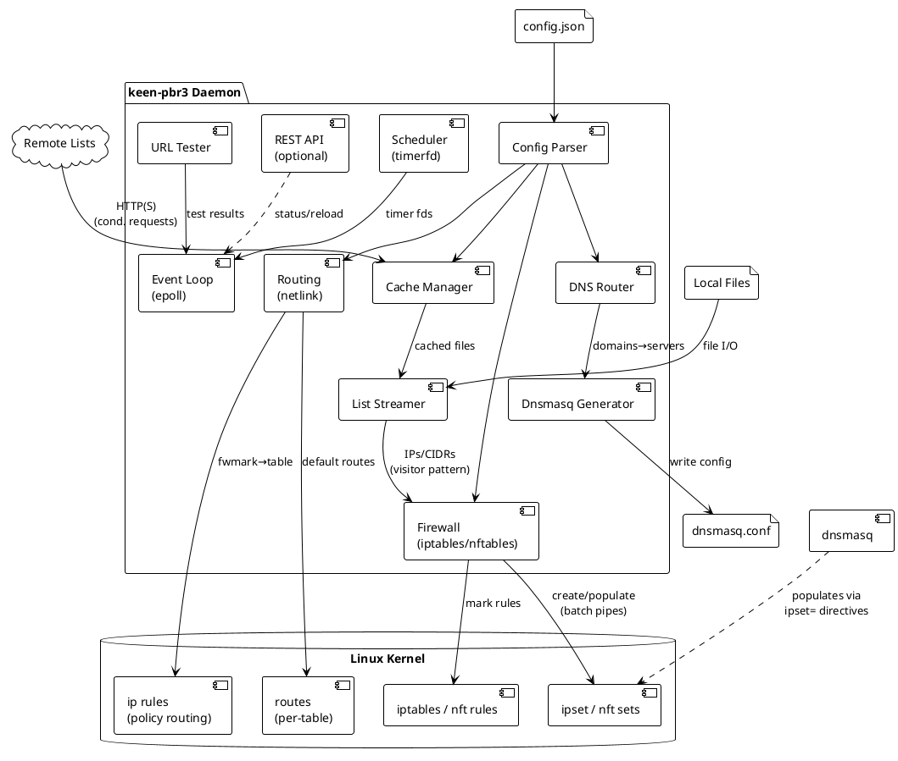

---

## High-Level Architecture

```plantuml
@startuml architecture
!theme plain
skinparam backgroundColor white
skinparam componentStyle rectangle

package "src/config/" {
  [config.hpp/cpp\nJSON parser] as ConfigParser
  [list_parser.hpp/cpp\nIP/domain parser] as ListParser
}

package "src/http/" {
  [http_client.hpp/cpp\nlibcurl wrapper] as HttpClient
}

package "src/cache/" {
  [cache_manager.hpp/cpp\nETag/304 caching] as CacheManager
}

package "src/lists/" {
  [list_streamer.hpp/cpp\nvisitor-based streaming] as ListStreamer
  [list_entry_visitor.hpp\nvisitor interface] as ListEntryVisitor
  [ipset.hpp/cpp\nbinary trie] as IpSet
}

package "src/routing/" {
  [target.hpp/cpp\nroute resolution] as Target
  [netlink.hpp/cpp\nlibnl3 wrapper] as Netlink
  [route_table.hpp/cpp\nroute tracking] as RouteTable
  [policy_rule.hpp/cpp\nrule tracking] as PolicyRule
  [firewall_state.hpp/cpp\nrule state tracker] as FirewallState
  [urltest_manager.hpp/cpp\nauto-select logic] as UrltestManager
}

package "src/firewall/" {
  [firewall.hpp/cpp\nabstract + factory] as FirewallBase
  [iptables.hpp/cpp\nipset + iptables] as Iptables
  [nftables.hpp/cpp\nnft CLI] as Nftables
  [ipset_restore_pipe.hpp\nbatch loading] as IpsetPipe
  [nft_batch_pipe.hpp\nbatch loading] as NftPipe
}

package "src/health/" {
  [url_tester.hpp/cpp\nHTTP URL testing] as URLTester
  [circuit_breaker.hpp/cpp\nstate machine] as CircuitBreaker
}

package "src/dns/" {
  [dns_server.hpp/cpp\ntype parser] as DnsServer
  [dns_router.hpp/cpp\nrule matching] as DnsRouter
  [dnsmasq_gen.hpp/cpp\nconfig writer] as DnsmasqGen
}

package "src/daemon/" {
  [daemon.hpp/cpp\nepoll + signalfd] as Daemon
  [scheduler.hpp/cpp\ntimerfd] as Scheduler
}

package "src/log/" {
  [logger.hpp/cpp\nsingleton logger] as Logger
}

package "src/api/" <<optional>> {
  [server.hpp/cpp\ncpp-httplib] as ApiServer
  [handlers.hpp/cpp\nGET/POST handlers] as ApiHandlers
}

[src/main.cpp\nentry point] as Main

Main --> ConfigParser
Main --> CacheManager
Main --> ListStreamer
Main --> FirewallBase
Main --> Netlink
Main --> RouteTable
Main --> PolicyRule
Main --> Target
Main --> URLTester
Main --> CircuitBreaker
Main --> DnsRouter
Main --> DnsmasqGen
Main --> Daemon
Main --> Scheduler
Main --> ApiServer
Main --> Logger

CacheManager --> HttpClient
ListStreamer --> CacheManager
ListStreamer --> ListParser
ListStreamer --> ListEntryVisitor
Iptables --> IpsetPipe
Nftables --> NftPipe
IpsetPipe --> ListEntryVisitor
NftPipe --> ListEntryVisitor
DnsRouter --> DnsServer
DnsmasqGen --> DnsRouter
DnsmasqGen --> ListStreamer
RouteTable --> Netlink
PolicyRule --> Netlink
Iptables --|> FirewallBase
Nftables --|> FirewallBase
UrltestManager --> URLTester
UrltestManager --> CircuitBreaker
Scheduler --> Daemon
ApiHandlers --> ApiServer
@enduml
```

---

## Module Dependency Graph

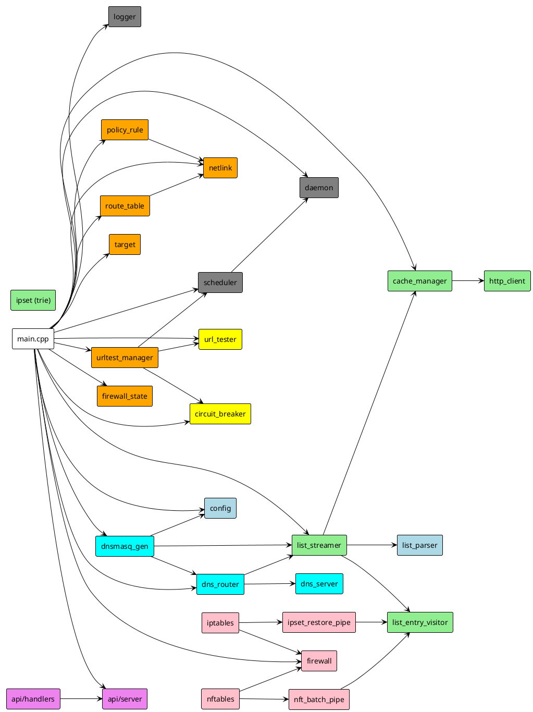

---

## Data Flow

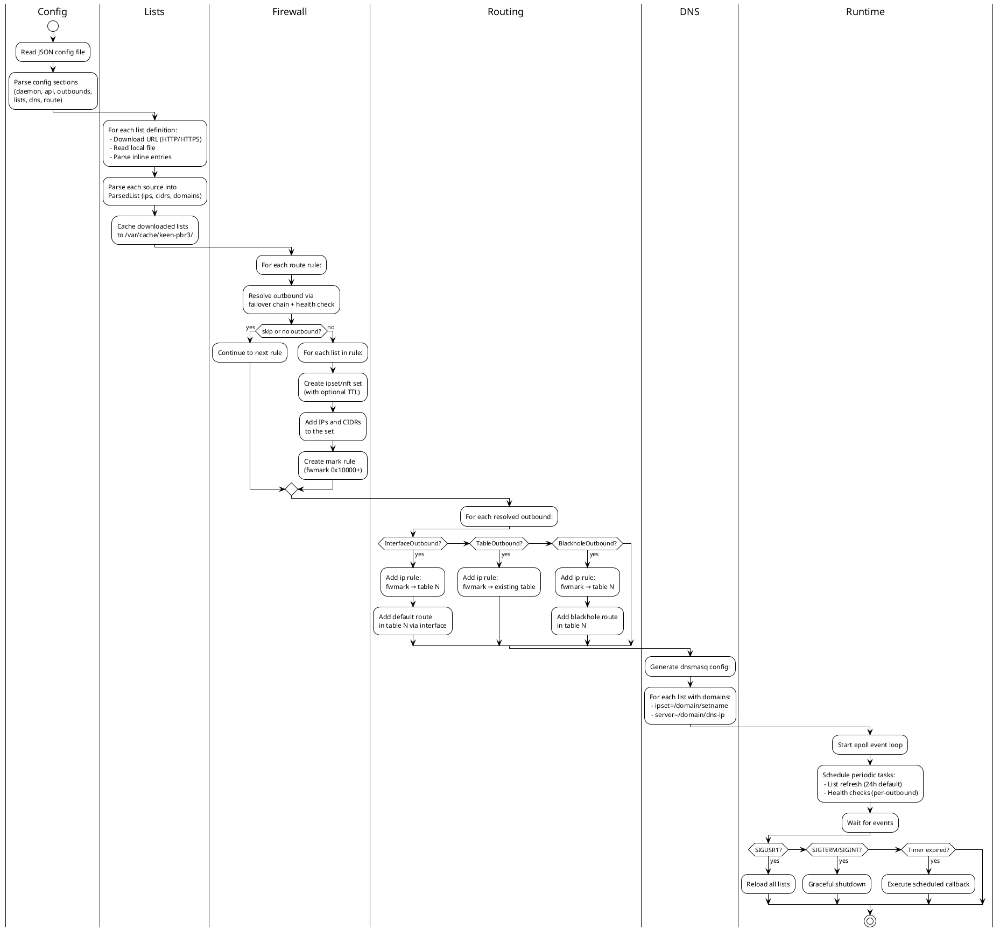

---

## Configuration Schema

The daemon reads a JSON configuration file (default: `/etc/keen-pbr3/config.json`).

### Top-Level Structure

```json
{
  "daemon": { ... },
  "api": { ... },
  "outbounds": [ ... ],
  "lists": { ... },
  "dns": { ... },
  "route": { ... }
}
```

### `daemon` Section

| Field | Type | Default | Description |
|-------|------|---------|-------------|
| `pid_file` | string | `""` | Path to PID file |
| `cache_dir` | string | `"/var/cache/keen-pbr3"` | Directory for list cache storage |

Duration strings: `"30s"`, `"5m"`, `"24h"` (seconds/minutes/hours).

### `api` Section

| Field | Type | Default | Description |
|-------|------|---------|-------------|
| `enabled` | bool | `false` | Enable REST API server |
| `listen` | string | `"127.0.0.1:8080"` | Listen address (host:port) |

### `outbounds` Section (array)

Each outbound has a `type` field that determines its variant:

**Interface Outbound** (`type: "interface"`):

| Field | Type | Default | Description |
|-------|------|---------|-------------|
| `tag` | string | required | Unique identifier |
| `interface` | string | required | Network interface name (e.g., `tun0`) |
| `gateway` | string | optional | Gateway IP for the interface |

**Table Outbound** (`type: "table"`):

| Field | Type | Description |
|-------|------|-------------|
| `tag` | string | Unique identifier |
| `table` | uint32 | Existing routing table ID |

**Blackhole Outbound** (`type: "blackhole"`):

| Field | Type | Description |
|-------|------|-------------|
| `tag` | string | Unique identifier |

Drops matching traffic (no routing table needed).

**Ignore Outbound** (`type: "ignore"`):

| Field | Type | Description |
|-------|------|-------------|
| `tag` | string | Unique identifier |

Skips routing for matching traffic (use system default routing).

**URLTest Outbound** (`type: "urltest"`):

| Field | Type | Default | Description |
|-------|------|---------|-------------|
| `tag` | string | required | Unique identifier |
| `url` | string | required | URL to test (e.g., `https://www.gstatic.com/generate_204`) |
| `interval_ms` | uint32 | `180000` | Test interval in milliseconds |
| `tolerance_ms` | uint32 | `100` | Latency tolerance for selection |
| `outbound_groups` | array | required | Groups of child outbounds with weights |
| `retry.attempts` | uint32 | `3` | Number of retry attempts |
| `retry.interval_ms` | uint32 | `1000` | Delay between retries |
| `circuit_breaker.failure_threshold` | uint32 | `5` | Failures before circuit opens |
| `circuit_breaker.success_threshold` | uint32 | `2` | Successes to close circuit |
| `circuit_breaker.timeout_ms` | uint32 | `30000` | Circuit breaker cooldown |
| `circuit_breaker.half_open_max_requests` | uint32 | `1` | Max probes in half-open state |

The URLTest outbound automatically selects the best child outbound based on HTTP latency tests. Supports weighted groups for preference-based selection.

### `lists` Section (object, keyed by list name)

| Field | Type | Description |
|-------|------|-------------|
| `url` | string | Remote list URL to download (supports ETag/304 caching) |
| `file` | string | Local file path |
| `domains` | string[] | Inline domain entries |
| `ip_cidrs` | string[] | Inline IP/CIDR entries |
| `ttl` | uint32 | TTL in seconds for dnsmasq-resolved ipset entries (0 = no timeout) |

All fields are optional. Sources are merged: URL content + file content + inline entries.

### `dns` Section

```json
{
  "servers": [
    { "tag": "my-dns", "address": "8.8.8.8", "detour": "vpn" }
  ],
  "rules": [
    { "list": ["list-name"], "server": "my-dns" }
  ],
  "fallback": "my-dns"
}
```

DNS server address types:
- **Plain IP**: `"8.8.8.8"`, `"2001:4860:4860::8888"`
- **DoH URL**: `"https://dns.google/dns-query"`
- **System**: `"system"` (use system resolver)
- **Blocked**: `"rcode://refused"` (refuse queries)

### `route` Section

```json
{
  "rules": [
    { "list": ["list-a", "list-b"], "outbound": "vpn" },
    { "list": ["list-c"], "outbound": "auto-select" }
  ],
  "fallback": "wan"
}
```

Route rules:
- `"outbound": "tag"` — Route to single outbound (can be interface, table, blackhole, ignore, or urltest)
- If outbound is `ignore`, traffic uses system default routing
- If outbound is `blackhole`, traffic is dropped
- If outbound is `urltest`, traffic routes to the currently selected child

### `fwmark` Section

```json
{
  "start": 65536,
  "mask": 16711680
}
```

| Field | Type | Default | Description |
|-------|------|---------|-------------|
| `start` | uint32 | `65536` (0x10000) | Starting fwmark value |
| `mask` | uint32 | `16711680` (0x00FF0000) | Fwmark mask for policy routing |

Fwmarks are allocated sequentially to interface and table outbounds. Blackhole, ignore, and urltest outbounds do NOT receive fwmarks.

### `iproute` Section

```json
{
  "table_start": 150
}
```

| Field | Type | Default | Description |
|-------|------|---------|-------------|
| `table_start` | uint32 | `150` | Starting routing table ID for policy routing |

Each interface outbound gets a dedicated routing table starting from this ID.

---

## CLI Interface

```
Usage: keen-pbr3 [options] <command>

Options:
  --config <path>    Path to JSON config file (default: /etc/keen-pbr3/config.json)
  --log-level <lvl>  Log level: error, warn, info, verbose, debug (default: info)
  --no-api           Disable REST API at runtime
  --version          Show version and exit
  --help             Show this help and exit

Commands:
  service               Start the routing service (foreground)
  download              Download all configured lists to cache and exit
  print-dnsmasq-config  Print generated dnsmasq config to stdout and exit
```

### `service` Command

Starts the daemon in foreground mode. Handles signals:
- `SIGTERM`/`SIGINT` — Graceful shutdown
- `SIGUSR1` — Verify routing tables and trigger immediate URL tests
- `SIGHUP` — Full reload (re-read config, re-download lists, rebuild firewall)

### `download` Command

Downloads all configured lists with URLs to cache, counts entries, updates metadata, then exits. Uses conditional requests (ETag/If-Modified-Since) to avoid re-downloading unchanged lists.

### `print-dnsmasq-config` Command

Special non-daemon mode: loads config, reads lists from cache (downloads if not cached), generates dnsmasq config, prints to stdout, then exits. Useful for integration with dnsmasq's `conf-dir` or piping to a file.

---

## Startup Sequence

```plantuml
@startuml startup
!theme plain
skinparam backgroundColor white

start

:Parse CLI arguments;

if (--version?) then (yes)
  :Print version;
  stop
endif

if (--help?) then (yes)
  :Print usage;
  stop
endif

:Read config file;
:Parse JSON → Config struct;

if (download command?) then (yes)
  :Create CacheManager;
  :For each list with URL:
    - Download with conditional request
    - Count entries via visitor
    - Save metadata;
  stop
endif

if (print-dnsmasq-config?) then (yes)
  :Create CacheManager;
  :Download uncached lists;
  :Create ListStreamer;
  :Create DnsRouter;
  :Create DnsmasqGenerator;
  :Print generated config to stdout;
  stop
endif

if (service command?) then (yes)
  :Initialize Logger;
endif

partition "Initialize Subsystems" {
  :Create CacheManager\n(cache_dir from config);
  :Create Firewall\n(auto-detect backend);
  :Create NetlinkManager\n(connect NETLINK_ROUTE);
  :Create RouteTable;
  :Create PolicyRuleManager;
  :Create FirewallState;
  :Create URLTester;
  :Allocate outbound fwmarks;
}

partition "Startup Tasks" {
  :Write PID file;
  :Download uncached lists;
  :Setup static routing tables\nand ip rules for each outbound;
  :Register URLTest outbounds\n(schedule periodic tests);
  :Apply firewall rules\n(create ipsets, stream entries);
  if (API enabled and not --no-api?) then (yes)
    :Create ApiServer;
    :Register API handlers;
    :Start API in background thread;
  endif
}

:daemon.run()\n(epoll_wait loop);

stop
@enduml
```

---

## Event Loop & Scheduling

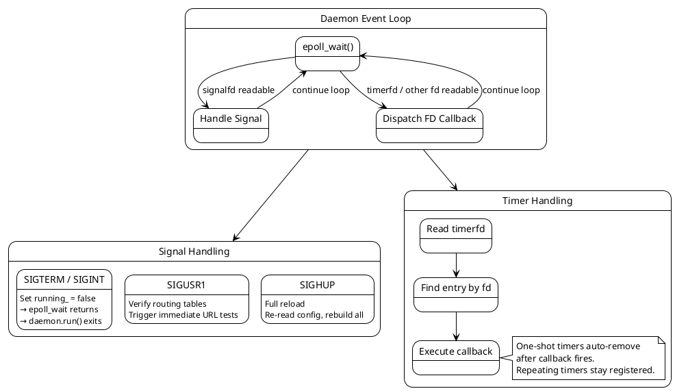

### Implementation Details

- **Daemon** creates an `epoll` instance (`epoll_create1(EPOLL_CLOEXEC)`)
- Signals (SIGTERM, SIGINT, SIGUSR1, SIGHUP) are blocked via `sigprocmask`, then handled through `signalfd`
- The signalfd is registered with epoll for edge notification
- External components (Scheduler timerfds) register via `add_fd(fd, events, callback)`
- `epoll_wait` blocks indefinitely (`timeout = -1`), EINTR is retried

### Scheduler

- Creates `timerfd` instances with `CLOCK_MONOTONIC` (immune to wall clock changes)
- Flags: `TFD_NONBLOCK | TFD_CLOEXEC`
- Repeating: sets both `it_value` and `it_interval` in `itimerspec`
- One-shot: sets only `it_value` (interval = {0,0})
- Must `read(fd, &uint64_t, 8)` to acknowledge timer, otherwise fd stays readable
- Registered timers:
  - **URL tests**: repeating, interval from `UrltestOutbound.interval_ms`

---

## List Management

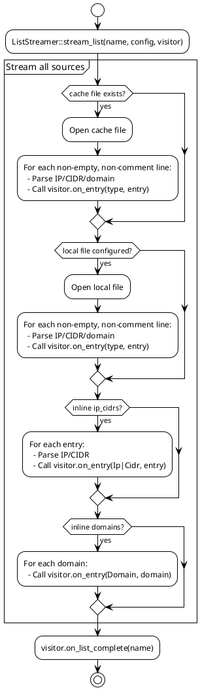

### Visitor Pattern

List entries are streamed one-by-one through a `ListEntryVisitor` interface, avoiding in-memory storage:

```cpp
class ListEntryVisitor {
public:
  virtual void on_entry(EntryType type, std::string_view entry) = 0;
  virtual void on_list_complete(const std::string& list_name);
  virtual void finish();
};
```

Entry types:
- `EntryType::Ip` — Individual IP address (e.g., `"192.168.1.1"`)
- `EntryType::Cidr` — CIDR subnet (e.g., `"10.0.0.0/8"`)
- `EntryType::Domain` — Domain name (e.g., `"example.com"`, `"*.example.org"`)

### Cache Management

`CacheManager` handles list caching with conditional requests:

- Downloads to `<cache_dir>/<name>.txt`
- Stores metadata in `<cache_dir>/<name>.meta.json` (ETag, Last-Modified, entry counts)
- Uses `If-None-Match`/`If-Modified-Since` headers for conditional requests
- Returns `false` from `download()` on 304 Not Modified

### Built-in Visitors

| Visitor | Purpose |
|---------|---------|
| `EntryCounter` | Counts entries by type without storing |
| `FunctionalVisitor` | Wraps a callback function |
| `IpsetRestoreVisitor` | Buffers `ipset add` commands for batch loading |
| `NftBatchVisitor` | Buffers `nft add element` commands for batch loading |

### IpSet (Binary Trie)

The `IpSet` class provides O(W) lookup (W = address width: 32 for IPv4, 128 for IPv6) using a binary trie (radix tree on individual bits). Separate tries for IPv4 and IPv6. Used internally but not currently integrated into the main traffic flow (firewall ipsets handle the actual matching in the kernel).

---

## Routing Pipeline

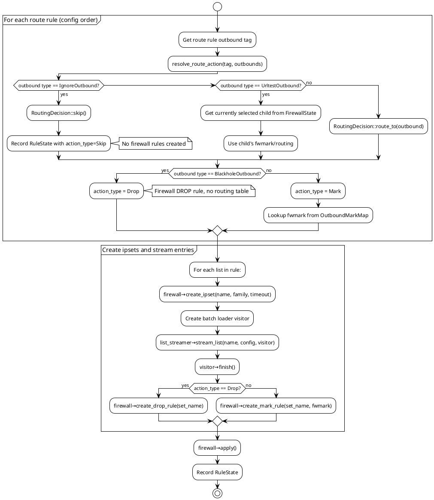

### Static Routing Setup

On startup, `setup_static_routing()` creates routing tables and ip rules for each interface/table outbound:

1. For each `InterfaceOutbound`:
   - Create routing table with ID = `table_start + offset`
   - Add default route via interface/gateway in that table
   - Add ip rule: `fwmark/mask → table_id`

2. For each `TableOutbound`:
   - Add ip rule: `fwmark/mask → table_id` (user-specified table)

3. Blackhole, Ignore, Urltest outbounds: no static routing needed
   - Blackhole: handled by firewall DROP rule
   - Ignore: uses system default routing
   - Urltest: resolved to child at firewall application time

### Fwmark Allocation

Fwmarks are allocated by `allocate_outbound_marks()`:
- Starting mark: `fwmark.start` (default 0x10000 = 65536)
- Each interface/table outbound gets the next sequential mark
- Mask: `fwmark.mask` (default 0x00FF0000)
- Table ID: `iproute.table_start + offset`

Blackhole, ignore, and urltest outbounds do NOT receive fwmarks.

### FirewallState Tracking

`FirewallState` tracks applied firewall configuration:
- `RuleState` per route rule (list names, outbound tag, action type, fwmark)
- `urltest_selections`: current child selection for each urltest outbound
- `outbound_marks`: fwmark assignments

When a urltest selection changes, the firewall is rebuilt with the new child's fwmark.

### Netlink Operations

All route/rule management goes through `NetlinkManager` which uses **libnl3**:

| Operation | libnl3 Function | Flags |
|-----------|----------------|-------|
| Add route | `rtnl_route_add()` | `NLM_F_CREATE \| NLM_F_REPLACE` (idempotent) |
| Delete route | `rtnl_route_delete()` | 0 |
| Add ip rule | `rtnl_rule_add()` | `NLM_F_CREATE \| NLM_F_EXCL` (fail on dup) |
| Delete ip rule | `rtnl_rule_delete()` | 0 |

When `family == 0`, rules are added for **both** AF_INET and AF_INET6.

### RouteTable & PolicyRuleManager

Both classes track installed specs in a vector:
- **Duplicate detection**: compare by value before adding
- **Cleanup**: remove in reverse order (LIFO)
- **Destructors**: best-effort cleanup (catch all exceptions)

---

## Firewall Backends

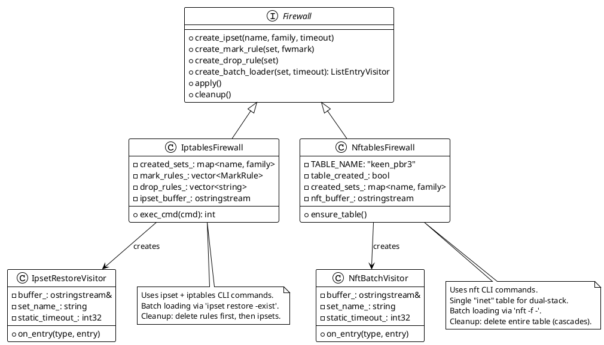

### Backend Detection

```
create_firewall("auto"):
  1. command -v nft    → NftablesFirewall
  2. command -v iptables → IptablesFirewall
  3. Neither found → throw FirewallError
```

### Batch Loading

Both backends use batch loading for efficient ipset population:

**iptables (ipset restore)**:
1. `create_batch_loader()` returns an `IpsetRestoreVisitor`
2. Visitor buffers `add <setname> <entry> [timeout N]\n` lines
3. `apply()` pipes the buffer to `ipset restore -exist`

**nftables**:
1. `create_batch_loader()` returns an `NftBatchVisitor`
2. Visitor buffers `add element inet keen_pbr3 <setname> { <entry> [timeout Ns] }\n` lines
3. `apply()` pipes the buffer to `nft -f -`

This avoids spawning a process per entry and provides atomic application.

### iptables Backend — Shell Commands Executed

| Operation | Shell Command |
|-----------|--------------|
| Create ipset | `ipset create <name> hash:net family <inet\|inet6> [timeout <N>] -exist` |
| Batch add | `ipset restore -exist` (piped input) |
| Flush ipset | `ipset flush <name> 2>/dev/null` |
| Destroy ipset | `ipset destroy <name> 2>/dev/null` |
| Create mark rule | `iptables -t mangle -A PREROUTING -m set --match-set <name> dst -j MARK --set-mark <0xHEX>` |
| Create drop rule | `iptables -t mangle -A PREROUTING -m set --match-set <name> dst -j DROP` |
| Delete mark rule | `iptables -t mangle -D PREROUTING -m set --match-set <name> dst -j MARK --set-mark <0xHEX> 2>/dev/null` |
| Delete drop rule | `iptables -t mangle -D PREROUTING -m set --match-set <name> dst -j DROP 2>/dev/null` |
| (IPv6 variant) | Replace `iptables` with `ip6tables` |

**Cleanup order**: Delete all mark/drop rules (reverse order) → destroy all ipsets.

### nftables Backend — Shell Commands Executed

| Operation | Shell Command |
|-----------|--------------|
| Create table | `nft add table inet keen_pbr3` |
| Create chain | `nft add chain inet keen_pbr3 PREROUTING '{ type filter hook prerouting priority mangle; policy accept; }'` |
| Create set | `nft add set inet keen_pbr3 <name> '{ type <ipv4_addr\|ipv6_addr>; flags <interval[, timeout]>; [timeout Ns;] }'` |
| Batch add element | `nft -f -` (piped input) |
| Create mark rule | `nft add rule inet keen_pbr3 PREROUTING ip daddr @<name> meta mark set <0xHEX>` |
| Create drop rule | `nft add rule inet keen_pbr3 PREROUTING ip daddr @<name> drop` |
| Flush set | `nft flush set inet keen_pbr3 <name> 2>/dev/null` |
| Delete set | `nft delete set inet keen_pbr3 <name> 2>/dev/null` |
| Cleanup (all) | `nft delete table inet keen_pbr3 2>/dev/null` |

**Key differences from iptables**:
- Single `inet` family table handles both IPv4 and IPv6
- Sets use `flags interval` to support both IPs and CIDRs
- Cleanup is a single table delete (cascades to everything)
- Batch loading via `nft -f -` instead of individual `nft add element` commands

---

## Health Checking & Circuit Breaker

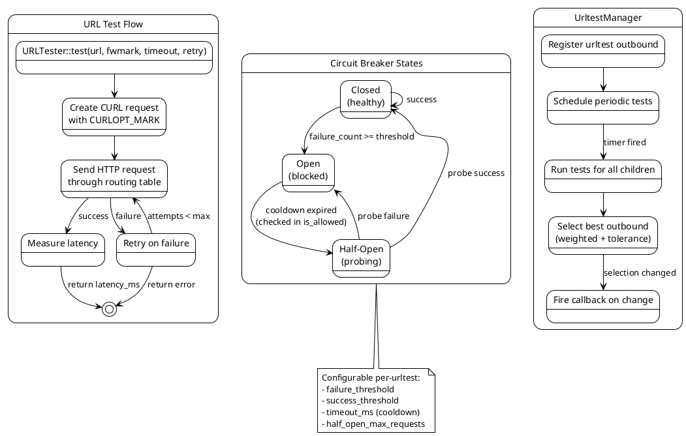

### URL Testing Details

`URLTester` uses libcurl with `CURLOPT_MARK` to route test traffic through the correct routing table:

1. Set `CURLOPT_MARK` to the child outbound's fwmark
2. Send HTTP request to the test URL (e.g., `https://www.gstatic.com/generate_204`)
3. Measure latency from fastest successful attempt
4. Retry up to `retry.attempts` times with `retry.interval_ms` delay

### Weighted Group Selection

`UrltestManager` selects the best child outbound using weighted groups:

1. For each outbound group:
   - Test all outbounds in the group
   - Skip outbounds with open circuit breakers
   - Record latency for successful tests
2. Select the group with the lowest average latency (respecting tolerance)
3. Within the selected group, choose the outbound with lowest latency
4. If all outbounds are circuit-broken, selection remains unchanged (or empty if first run)

### Circuit Breaker Integration

Each child outbound has its own circuit breaker:
- **Closed**: Outbound is healthy, tests pass through
- **Open**: Too many failures, outbound is skipped
- **Half-Open**: Cooldown expired, allowing probe requests

When the selected outbound changes:
1. `UrltestManager` calls the registered callback
2. `FirewallState` is updated with the new selection
3. Firewall rules are rebuilt with the new child's fwmark

---

## DNS Routing & Dnsmasq Integration

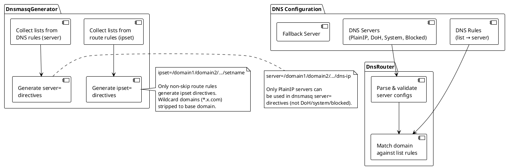

### DNS Server Types

| Type | Address Format | Dnsmasq Support |
|------|---------------|-----------------|
| PlainIP | `"8.8.8.8"`, `"2001:db8::1"` | Yes (`server=` directive) |
| DoH | `"https://dns.google/dns-query"` | No |
| System | `"system"` | No |
| Blocked | `"rcode://refused"` | No |

### Generated Dnsmasq Config Example

```
# Generated by keen-pbr3 - do not edit manually

# List: my-domains
ipset=/example.com/example.org/my-domains
server=/example.com/example.org/10.8.0.1
```

### Domain Matching in DnsRouter

1. For each DNS rule (config order, first match wins):
   - Get the list's parsed domains
   - For each domain in the list:
     - Exact match: `domain == query`
     - Wildcard match: `*.example.com` matches `sub.example.com` AND `example.com` itself
2. If no rule matches → use fallback server

---

## REST API

Compiled only when `with_api` Meson option is `true` (default). Guarded by `#ifdef WITH_API`.

### Architecture

- **cpp-httplib** server runs in a background `std::thread`
- `Server::listen()` is blocking; `Server::stop()` is thread-safe
- Pimpl pattern hides httplib.h from the header
- `ApiContext` holds non-owning references to subsystems

### Endpoints

#### `GET /api/status`

Returns daemon status, version, active outbounds, and loaded list statistics.

```json
{
  "version": "3.0.0",
  "status": "running",
  "outbounds": [
    { "tag": "vpn", "type": "interface", "interface": "tun0", "gateway": "10.8.0.1", "ping_target": "8.8.8.8" },
    { "tag": "block", "type": "blackhole" }
  ],
  "lists": {
    "my-domains": { "ips": 0, "cidrs": 0, "domains": 5 },
    "my-ips": { "ips": 1, "cidrs": 1, "domains": 0 }
  }
}
```

#### `POST /api/reload`

Triggers immediate re-download and refresh of all lists (same as SIGUSR1).

```json
{ "status": "ok", "message": "Reload triggered" }
```

#### `GET /api/health`

Returns health check status for all configured outbounds.

```json
{
  "outbounds": [
    { "tag": "vpn", "type": "interface", "monitored": true, "status": "healthy" },
    { "tag": "wan", "type": "interface", "monitored": false, "status": "healthy" },
    { "tag": "block", "type": "blackhole", "monitored": false, "status": "healthy" }
  ]
}
```

Unmonitored outbounds (no `ping_target`) always report as `"healthy"`.

---

## Shutdown Sequence

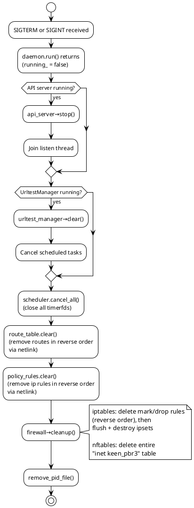

**Shutdown order** (dependencies require this sequence):
1. **API server** — stop accepting requests, join thread
2. **UrltestManager** — cancel scheduled tests
3. **Scheduler** — cancel all timers, close timerfds
4. **RouteTable** — remove routes (reverse order via netlink)
5. **PolicyRuleManager** — remove ip rules (reverse order via netlink)
6. **Firewall** — remove mark/drop rules, then ipsets
7. **PID file** — filesystem cleanup

---

## Build System

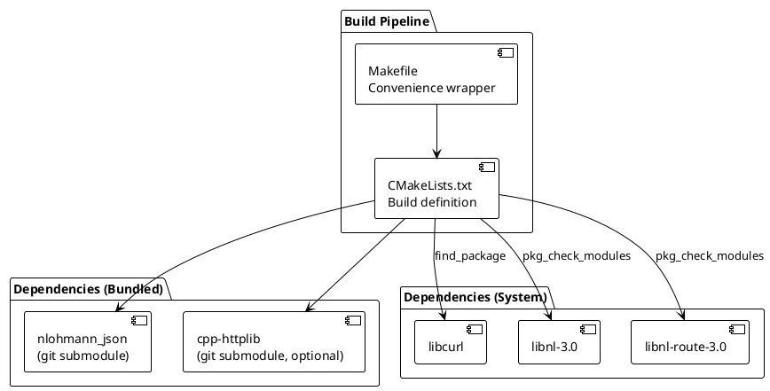

### CMake Build Options

| Option | Type | Default | Description |
|--------|------|---------|-------------|
| `WITH_API` | boolean | `ON` | Include REST API (cpp-httplib) |

### Compiler Flags

- Standard: C++20 (requires GCC 13+ or Clang 17+ for `<format>`)
- Optimization: `-Os` (size), `-ffunction-sections`, `-fdata-sections`
- Linker: `-Wl,--gc-sections` (dead code elimination)
- API flag: `-DWITH_API` (when `WITH_API` is ON)

### Build Commands

```bash
# Native build
make setup    # meson setup (or cmake -B build)
make build    # compile

# Or directly with CMake:
cmake -B build -DCMAKE_BUILD_TYPE=Release
cmake --build build

# Build without API
cmake -B build -DWITH_API=OFF
cmake --build build
```

### Dependencies

**Bundled (git submodules)**:
- `third_party/nlohmann_json` — JSON parsing
- `third_party/cpp-httplib` — REST API server (optional)

**System packages**:
- `libcurl` — HTTP client for list downloads
- `libnl-3.0`, `libnl-route-3.0` — Netlink route/rule management

### Source Files (28 total)

**Core (26 files):**
```
src/main.cpp
src/log/logger.cpp
src/config/config.cpp
src/config/list_parser.cpp
src/http/http_client.cpp
src/cache/cache_manager.cpp
src/lists/ipset.cpp
src/lists/list_streamer.cpp
src/routing/target.cpp
src/routing/netlink.cpp
src/routing/route_table.cpp
src/routing/policy_rule.cpp
src/routing/firewall_state.cpp
src/routing/urltest_manager.cpp
src/health/circuit_breaker.cpp
src/health/url_tester.cpp
src/firewall/firewall.cpp
src/firewall/iptables.cpp
src/firewall/nftables.cpp
src/firewall/ipset_restore_pipe.cpp
src/firewall/nft_batch_pipe.cpp
src/dns/dns_server.cpp
src/dns/dns_router.cpp
src/dns/dnsmasq_gen.cpp
src/daemon/daemon.cpp
src/daemon/scheduler.cpp
```

**Conditional API (2 files, when `WITH_API` is ON):**
```
src/api/server.cpp
src/api/handlers.cpp
```

---

## Cross-Compilation

### Supported Architectures

| Architecture | Docker Build | Target |
|-------------|--------------|--------|
| `mips-be-openwrt` | Dockerfile.openwrt | MIPS big-endian OpenWRT |
| `mips-le-openwrt` | Dockerfile.openwrt | MIPS little-endian OpenWRT |
| `arm-openwrt` | Dockerfile.openwrt | ARMv7hf OpenWRT |
| `aarch64-openwrt` | Dockerfile.openwrt | AArch64 (ARMv8) OpenWRT |
| `x86_64-openwrt` | Dockerfile.openwrt | x86_64 OpenWRT |
| `mips-le-keenetic` | Dockerfile.openwrt | MIPS little-endian Keenetic |

### Build Commands

```bash
# Cross-build via Docker
docker build -f docker/Dockerfile.openwrt -t keen-pbr3-builder .
docker run --rm -v "$PWD/dist:/src/dist" keen-pbr3-builder mips-le-openwrt

# Output binaries go to dist/<arch>/keen-pbr3
```

### Docker Build Details

The Dockerfile builds:
1. OpenWRT SDK for the target architecture
2. Compiles keen-pbr3 with static linking
3. Optionally builds .ipk packages for OpenWRT

Use `docker/Dockerfile.packages` for full package build with OpenWRT SDK integration.

---

## CI/CD Pipeline

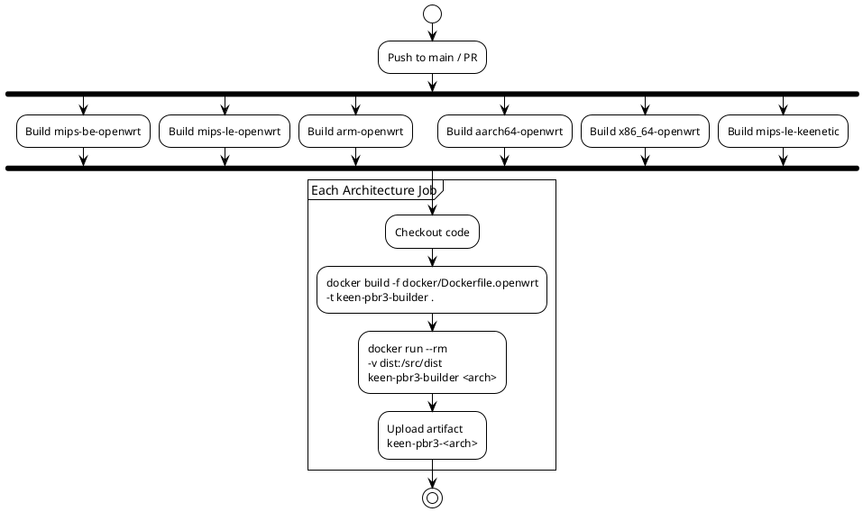

- **Trigger**: Push to `main` or pull request to `main`
- **Strategy**: Matrix build, `fail-fast: false` (one failure doesn't cancel others)
- **Artifacts**: `keen-pbr3-<arch>` binary per architecture
- **Docker image**: Built per-job (no caching between jobs)

---

## File Layout

```
keen-pbr3/
├── include/
│   └── keen-pbr3/
│       └── version.hpp              # Version macros (3.0.0)
├── src/
│   ├── main.cpp                     # Entry point, CLI, command dispatch
│   ├── config/
│   │   ├── config.hpp               # Config structs + parse_config()
│   │   ├── config.cpp               # JSON deserialization (nlohmann_json)
│   │   ├── list_parser.hpp          # ParsedList, ListParser
│   │   └── list_parser.cpp          # IP/domain classification
│   ├── http/
│   │   ├── http_client.hpp          # HttpClient, HttpError
│   │   └── http_client.cpp          # libcurl wrapper
│   ├── cache/
│   │   ├── cache_manager.hpp        # CacheManager, CacheMetadata
│   │   └── cache_manager.cpp        # ETag/304 caching, metadata storage
│   ├── lists/
│   │   ├── ipset.hpp                # IpSet, IpTrie (binary trie)
│   │   ├── ipset.cpp                # Trie insert/contains
│   │   ├── list_streamer.hpp        # ListStreamer
│   │   ├── list_streamer.cpp        # Visitor-based list streaming
│   │   └── list_entry_visitor.hpp   # ListEntryVisitor interface, EntryCounter
│   ├── routing/
│   │   ├── target.hpp               # RoutingDecision, resolve_route_action()
│   │   ├── target.cpp               # Outbound type resolution
│   │   ├── netlink.hpp              # NetlinkManager, RouteSpec, RuleSpec
│   │   ├── netlink.cpp              # libnl3 route/rule operations
│   │   ├── route_table.hpp          # RouteTable (tracking)
│   │   ├── route_table.cpp          # Add/remove/clear routes
│   │   ├── policy_rule.hpp          # PolicyRuleManager (tracking)
│   │   ├── policy_rule.cpp          # Add/remove/clear ip rules
│   │   ├── firewall_state.hpp       # FirewallState, RuleState
│   │   ├── firewall_state.cpp       # Rule state tracking
│   │   ├── urltest_manager.hpp      # UrltestManager, UrltestState
│   │   └── urltest_manager.cpp      # Periodic URL test management
│   ├── firewall/
│   │   ├── firewall.hpp             # Abstract Firewall, factory
│   │   ├── firewall.cpp             # Backend detection, create_firewall()
│   │   ├── iptables.hpp             # IptablesFirewall
│   │   ├── iptables.cpp             # ipset + iptables CLI
│   │   ├── nftables.hpp             # NftablesFirewall
│   │   ├── nftables.cpp             # nft CLI
│   │   ├── ipset_restore_pipe.hpp   # IpsetRestoreVisitor
│   │   ├── ipset_restore_pipe.cpp   # Batch ipset loading
│   │   ├── nft_batch_pipe.hpp       # NftBatchVisitor
│   │   └── nft_batch_pipe.cpp       # Batch nft element loading
│   ├── health/
│   │   ├── url_tester.hpp           # URLTester, URLTestResult
│   │   ├── url_tester.cpp           # HTTP URL testing via libcurl
│   │   ├── circuit_breaker.hpp      # CircuitBreaker, CircuitState
│   │   └── circuit_breaker.cpp      # State machine
│   ├── dns/
│   │   ├── dns_server.hpp           # DnsServerType, DnsServerConfig
│   │   ├── dns_server.cpp           # Address type detection
│   │   ├── dns_router.hpp           # DnsRouter
│   │   ├── dns_router.cpp           # Domain → DNS server matching
│   │   ├── dnsmasq_gen.hpp          # DnsmasqGenerator
│   │   └── dnsmasq_gen.cpp          # ipset=/server= generation
│   ├── daemon/
│   │   ├── daemon.hpp               # Daemon (epoll + signalfd)
│   │   ├── daemon.cpp               # Event loop, signal handling
│   │   ├── scheduler.hpp            # Scheduler (timerfd)
│   │   └── scheduler.cpp            # Repeating/oneshot timers
│   ├── log/
│   │   ├── logger.hpp               # Logger (singleton)
│   │   └── logger.cpp               # Templated log functions
│   └── api/                         # (conditional: WITH_API)
│       ├── server.hpp               # ApiServer (pimpl)
│       ├── server.cpp               # cpp-httplib background thread
│       ├── handlers.hpp             # ApiContext, register_api_handlers()
│       └── handlers.cpp             # GET/POST endpoint handlers
├── third_party/
│   ├── nlohmann_json/               # JSON library (git submodule)
│   └── cpp-httplib/                 # HTTP server (git submodule, optional)
├── docker/
│   ├── Dockerfile.openwrt           # Cross-compilation container
│   └── Dockerfile.packages          # OpenWRT package builder
├── .github/
│   └── workflows/
│       └── build.yml                # CI matrix build
├── CMakeLists.txt                   # CMake build definition
├── Makefile                         # Convenience wrapper
├── config.example.json              # Example configuration
└── .gitignore
```

---

## External Commands Reference

Complete list of all shell commands the daemon may execute at runtime:

### Firewall Backend Detection

| Command | Purpose |
|---------|---------|
| `command -v nft >/dev/null 2>&1` | Check if nft is available |
| `command -v iptables >/dev/null 2>&1` | Check if iptables is available |

### iptables Backend

| Command | Purpose |
|---------|---------|
| `ipset create <name> hash:net family <inet\|inet6> [timeout <N>] -exist` | Create IP set |
| `ipset restore -exist` | Batch add entries (piped input) |
| `ipset flush <name> 2>/dev/null` | Clear all entries |
| `ipset destroy <name> 2>/dev/null` | Delete set |
| `iptables -t mangle -A PREROUTING -m set --match-set <name> dst -j MARK --set-mark 0x<HEX>` | Create packet mark rule |
| `iptables -t mangle -A PREROUTING -m set --match-set <name> dst -j DROP` | Create drop rule |
| `iptables -t mangle -D PREROUTING -m set --match-set <name> dst -j MARK --set-mark 0x<HEX> 2>/dev/null` | Delete mark rule |
| `iptables -t mangle -D PREROUTING -m set --match-set <name> dst -j DROP 2>/dev/null` | Delete drop rule |
| `ip6tables -t mangle -A PREROUTING ...` | IPv6 variants |
| `ip6tables -t mangle -D PREROUTING ...` | IPv6 variants |

### nftables Backend

| Command | Purpose |
|---------|---------|
| `nft add table inet keen_pbr3` | Create dual-stack table |
| `nft add chain inet keen_pbr3 PREROUTING '{ type filter hook prerouting priority mangle; policy accept; }'` | Create prerouting chain |
| `nft add set inet keen_pbr3 <name> '{ type <ipv4_addr\|ipv6_addr>; flags <interval[, timeout]>; [timeout Ns;] }'` | Create set |
| `nft -f -` | Batch add elements (piped input) |
| `nft add rule inet keen_pbr3 PREROUTING ip daddr @<name> meta mark set 0x<HEX>` | Create mark rule |
| `nft add rule inet keen_pbr3 PREROUTING ip daddr @<name> drop` | Create drop rule |
| `nft flush set inet keen_pbr3 <name> 2>/dev/null` | Clear set |
| `nft delete set inet keen_pbr3 <name> 2>/dev/null` | Delete set |
| `nft delete table inet keen_pbr3 2>/dev/null` | Delete entire table (cleanup) |

### Netlink (kernel API, not shell)

These operations use the **libnl3** C library directly (not shell commands):

| Operation | Kernel Effect |
|-----------|--------------|
| `rtnl_route_add(NLM_F_CREATE\|NLM_F_REPLACE)` | `ip route add/replace default via <gw> dev <iface> table <N>` |
| `rtnl_route_delete()` | `ip route del default table <N>` |
| `rtnl_rule_add(NLM_F_CREATE\|NLM_F_EXCL)` | `ip rule add fwmark 0x<HEX>/<mask> table <N> priority <P>` |
| `rtnl_rule_delete()` | `ip rule del fwmark 0x<HEX>/<mask> table <N>` |

---

## Packet Flow (End-to-End)

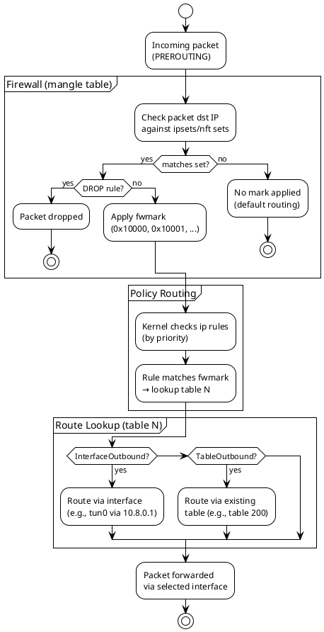

### Domain-Based Flow (via dnsmasq)

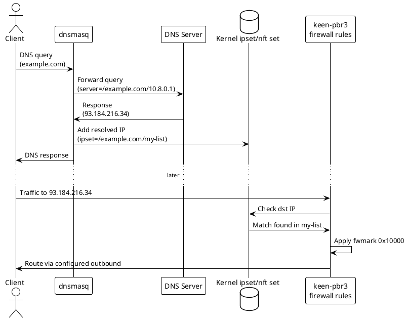

---

## Key Implementation Details

### Visitor Pattern for List Processing

Lists are processed through a visitor interface, avoiding in-memory storage of all entries:

```cpp
class ListEntryVisitor {
  virtual void on_entry(EntryType type, std::string_view entry) = 0;
  virtual void on_list_complete(const std::string& list_name);
  virtual void finish();
};
```

This enables:
- Streaming entries directly to batch loaders
- Counting entries without storing them
- Processing lists from multiple sources (cache, local file, inline)

### Batch Loading for Firewall Sets

Both iptables and nftables backends use batch loading:

1. `Firewall::create_batch_loader()` returns a visitor
2. `ListStreamer` streams entries through the visitor
3. Visitor buffers commands to an ostringstream
4. `Firewall::apply()` pipes the buffer to the CLI tool

This is significantly faster than spawning a process per entry.

### URLTest Auto-Selection

UrltestManager runs periodic HTTP tests through each child outbound:

1. Uses `CURLOPT_MARK` to route test traffic via correct table
2. Measures latency, applies circuit breaker logic
3. Selects best outbound using weighted group algorithm
4. Triggers firewall rebuild on selection change

### FirewallState as Source of Truth

`FirewallState` tracks:
- Applied `RuleState` per route rule
- Current urltest selections
- Outbound fwmark assignments

This enables:
- API endpoints to report current state
- Efficient firewall rebuilds on urltest changes
- Proper cleanup on shutdown
