# keen-pbr3 Architecture & State Document

**Version:** 3.0.0
**Language:** C++20
**Target platforms:** OpenWRT (MIPS, ARM, AArch64, x86_64), Keenetic (MIPS LE)

## Table of Contents

1. [Overview](#overview)
2. [High-Level Architecture](#high-level-architecture)
3. [Module Dependency Graph](#module-dependency-graph)
4. [Data Flow](#data-flow)
5. [Configuration Schema](#configuration-schema)
6. [CLI Interface](#cli-interface)
7. [Startup Sequence](#startup-sequence)
8. [Event Loop & Scheduling](#event-loop--scheduling)
9. [List Management](#list-management)
10. [Routing Pipeline](#routing-pipeline)
11. [Firewall Backends](#firewall-backends)
12. [Health Checking & Circuit Breaker](#health-checking--circuit-breaker)
13. [DNS Routing & Dnsmasq Integration](#dns-routing--dnsmasq-integration)
14. [REST API](#rest-api)
15. [Shutdown Sequence](#shutdown-sequence)
16. [Build System](#build-system)
17. [Cross-Compilation](#cross-compilation)
18. [CI/CD Pipeline](#cicd-pipeline)
19. [File Layout](#file-layout)
20. [External Commands Reference](#external-commands-reference)

---

## Overview

keen-pbr3 is a policy-based routing daemon for Linux routers. It enables selective routing of traffic based on destination IP addresses, CIDR subnets, and domain names. Traffic matching configured lists is marked with firewall marks (fwmarks) and routed through specific network interfaces, routing tables, or blackholed.

Key capabilities:
- Download and parse IP/domain lists from URLs, local files, or inline config
- Create kernel ipsets/nft sets and populate them with IPs/CIDRs
- Generate dnsmasq config for domain-based ipset population
- Install fwmark-based ip rules and routes via netlink
- ICMP health checking with circuit breaker for interface failover
- Periodic list refresh and on-demand reload via SIGUSR1
- Optional REST API for status, health, and reload

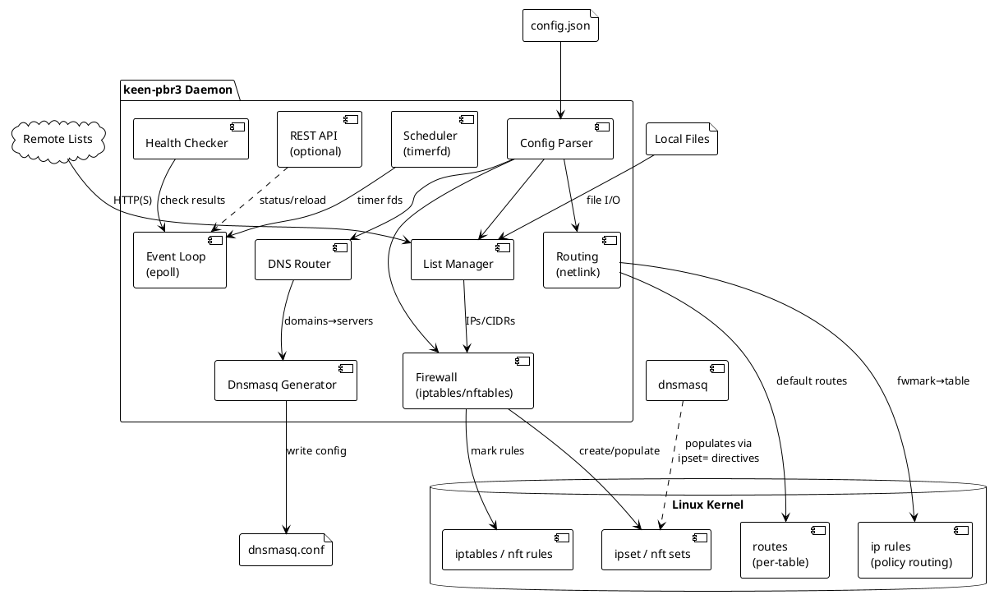

---

## High-Level Architecture

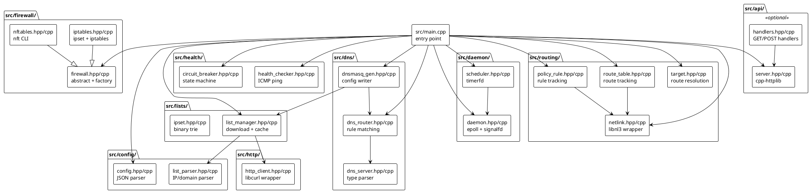

---

## Module Dependency Graph

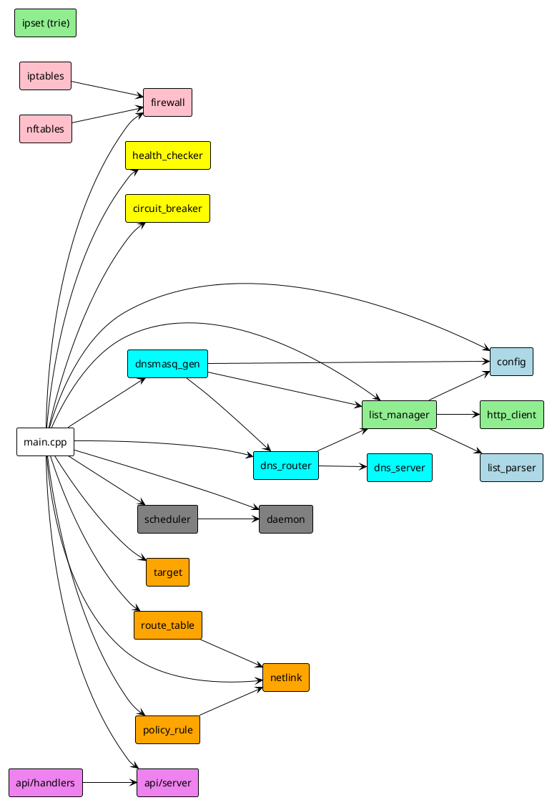

---

## Data Flow

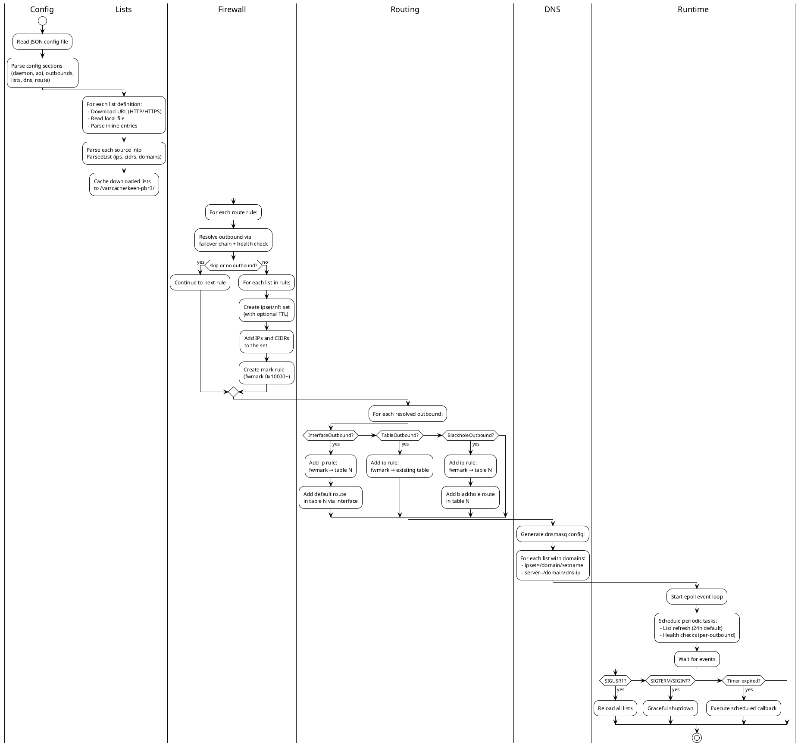

---

## Configuration Schema

The daemon reads a JSON configuration file (default: `/etc/keen-pbr3/config.json`).

### Top-Level Structure

```json
{
  "daemon": { ... },
  "api": { ... },
  "outbounds": [ ... ],
  "lists": { ... },
  "dns": { ... },
  "route": { ... }
}
```

### `daemon` Section

| Field | Type | Default | Description |
|-------|------|---------|-------------|
| `pid_file` | string | `""` | Path to PID file |
| `list_update_interval` | duration string | `"24h"` | How often to re-download lists |

Duration strings: `"30s"`, `"5m"`, `"24h"` (seconds/minutes/hours).

### `api` Section

| Field | Type | Default | Description |
|-------|------|---------|-------------|
| `enabled` | bool | `false` | Enable REST API server |
| `listen` | string | `"127.0.0.1:8080"` | Listen address (host:port) |

### `outbounds` Section (array)

Each outbound has a `type` field that determines its variant:

**Interface Outbound** (`type: "interface"`):

| Field | Type | Default | Description |
|-------|------|---------|-------------|
| `tag` | string | required | Unique identifier |
| `interface` | string | required | Network interface name (e.g., `tun0`) |
| `gateway` | string | optional | Gateway IP for the interface |
| `ping_target` | string | optional | IP to ping for health checks |
| `ping_interval` | duration | `"30s"` | Health check interval |
| `ping_timeout` | duration | `"5s"` | Ping timeout |

**Table Outbound** (`type: "table"`):

| Field | Type | Description |
|-------|------|-------------|
| `tag` | string | Unique identifier |
| `table` | uint32 | Existing routing table ID |

**Blackhole Outbound** (`type: "blackhole"`):

| Field | Type | Description |
|-------|------|-------------|
| `tag` | string | Unique identifier |

### `lists` Section (object, keyed by list name)

| Field | Type | Description |
|-------|------|-------------|
| `url` | string | Remote list URL to download |
| `file` | string | Local file path |
| `domains` | string[] | Inline domain entries |
| `ip_cidrs` | string[] | Inline IP/CIDR entries |
| `ttl` | uint32/duration | TTL for dnsmasq-resolved ipset entries (seconds) |

All fields are optional. Sources are merged: URL content + file content + inline entries.

### `dns` Section

```json
{
  "servers": [
    { "tag": "my-dns", "address": "8.8.8.8", "detour": "vpn" }
  ],
  "rules": [
    { "list": ["list-name"], "server": "my-dns" }
  ],
  "fallback": "my-dns"
}
```

DNS server address types:
- **Plain IP**: `"8.8.8.8"`, `"2001:4860:4860::8888"`
- **DoH URL**: `"https://dns.google/dns-query"`
- **System**: `"system"` (use system resolver)
- **Blocked**: `"rcode://refused"` (refuse queries)

### `route` Section

```json
{
  "rules": [
    { "list": ["list-a", "list-b"], "outbound": "vpn" },
    { "list": ["list-c"], "outbounds": ["vpn", "wan"] },
    { "list": ["list-d"], "action": "skip" }
  ],
  "fallback": "wan"
}
```

Route rule actions (mutually exclusive):
- `"outbound": "tag"` — Route to single outbound
- `"outbounds": ["tag1", "tag2"]` — Failover chain (first healthy wins)
- `"action": "skip"` — Skip this rule (no routing applied)

---

## CLI Interface

```
Usage: keen-pbr3 [options]

Options:
  --config <path>  Path to JSON config file (default: /etc/keen-pbr3/config.json)
  -d               Daemonize (run in background)
  --no-api         Disable REST API at runtime
  --version, -v    Show version and exit
  --help, -h       Show help and exit

Commands:
  print-dnsmasq-config  Print generated dnsmasq config to stdout and exit
```

### `print-dnsmasq-config` Command

Special non-daemon mode: loads config, downloads/caches lists (readonly mode), generates dnsmasq config, prints to stdout, then exits. Useful for integration with dnsmasq's `conf-dir` or piping to a file.

---

## Startup Sequence

```plantuml
@startuml startup
!theme plain
skinparam backgroundColor white

start

:Parse CLI arguments;

if (--version?) then (yes)
  :Print version;
  stop
endif

if (--help?) then (yes)
  :Print usage;
  stop
endif

:Read config file;
:Parse JSON → Config struct;

if (print-dnsmasq-config?) then (yes)
  :Create ListManager (readonly);
  :Load lists from cache;
  :Create DnsRouter;
  :Create DnsmasqGenerator;
  :Print generated config to stdout;
  stop
endif

if (-d daemonize?) then (yes)
  :fork() → parent exits;
  :setsid() → new session;
  :Redirect stdio → /dev/null;
endif

:Write PID file;

partition "Initialize Subsystems" {
  :Create ListManager\n(/var/cache/keen-pbr3);
  :Create HealthChecker;
  :Create CircuitBreaker;
  :Create Firewall\n(auto-detect backend);
  :Create NetlinkManager\n(connect NETLINK_ROUTE);
  :Create RouteTable;
  :Create PolicyRuleManager;
}

:Register interface outbounds\nfor health checking;
:Download and load all lists;

partition "Apply Firewall & Routing" {
  :fwmark = 0x10000;
  repeat
    :Process next route rule;
    :Resolve outbound\n(health check + failover);
    if (skip or no outbound?) then (yes)
      :Skip;
    else (no)
      :Create ipsets for each list;
      :Add IPs/CIDRs to ipsets;
      :Create mark rule (fwmark);
      :Add ip rule (fwmark → table);
      :Add route (default via outbound);
      :fwmark++;
    endif
  repeat while (more rules?)
  :firewall→apply();
}

partition "Setup Event Loop" {
  :Create Daemon\n(epoll + signalfd);
  :Create Scheduler;
  :Register SIGUSR1 → reload;
  :Schedule periodic list update;
  :Schedule health checks;
  if (API enabled and not --no-api?) then (yes)
    :Create ApiServer;
    :Register API handlers;
    :Start API in background thread;
  endif
}

:daemon.run()\n(epoll_wait loop);

stop
@enduml
```

---

## Event Loop & Scheduling

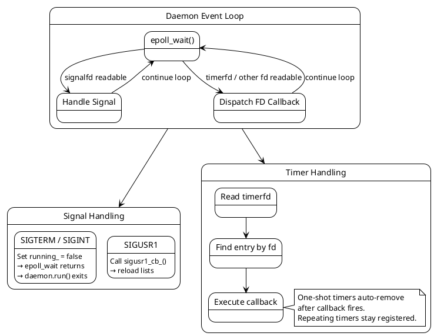

### Implementation Details

- **Daemon** creates an `epoll` instance (`epoll_create1(EPOLL_CLOEXEC)`)
- Signals (SIGTERM, SIGINT, SIGUSR1) are blocked via `sigprocmask`, then handled through `signalfd`
- The signalfd is registered with epoll for edge notification
- External components (Scheduler timerfds) register via `add_fd(fd, events, callback)`
- `epoll_wait` blocks indefinitely (`timeout = -1`), EINTR is retried

### Scheduler

- Creates `timerfd` instances with `CLOCK_MONOTONIC` (immune to wall clock changes)
- Flags: `TFD_NONBLOCK | TFD_CLOEXEC`
- Repeating: sets both `it_value` and `it_interval` in `itimerspec`
- One-shot: sets only `it_value` (interval = {0,0})
- Must `read(fd, &uint64_t, 8)` to acknowledge timer, otherwise fd stays readable
- Registered timers:
  - **List refresh**: repeating, interval from `daemon.list_update_interval`
  - **Health checks**: one repeating timer per outbound with `ping_target`, interval from `ping_interval`

---

## List Management

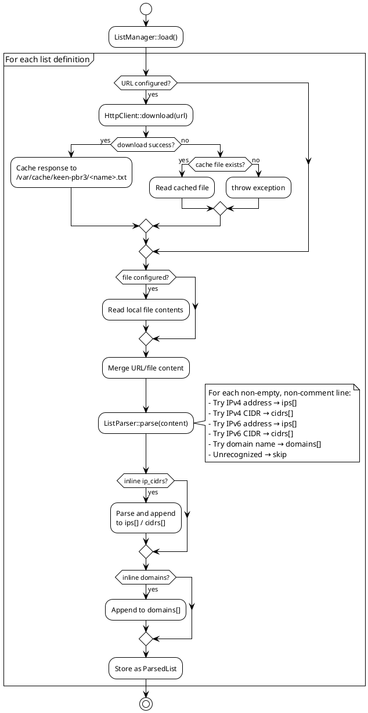

### ParsedList Structure

```
ParsedList {
  ips: vector<string>      // Individual IP addresses (e.g., "1.2.3.4")
  cidrs: vector<string>    // CIDR subnets (e.g., "10.0.0.0/8")
  domains: vector<string>  // Domain names (e.g., "example.com", "*.example.org")
}
```

### IpSet (Binary Trie)

The `IpSet` class provides O(W) lookup (W = address width: 32 for IPv4, 128 for IPv6) using a binary trie (radix tree on individual bits). Separate tries for IPv4 and IPv6. Used internally but not currently integrated into the main traffic flow (firewall ipsets handle the actual matching in the kernel).

---

## Routing Pipeline

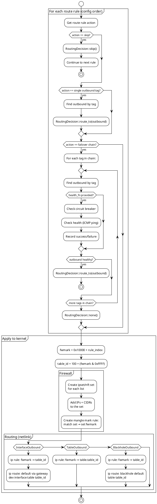

### Fwmark Allocation

- Starting mark: `0x10000`
- Each route rule gets the next sequential mark: `0x10000`, `0x10001`, `0x10002`, ...
- Table ID derived from mark: `100 + (fwmark & 0xFFFF)` → 100, 101, 102, ...
- Policy rule priority matches table ID

### Netlink Operations

All route/rule management goes through `NetlinkManager` which uses **libnl3**:

| Operation | libnl3 Function | Flags |
|-----------|----------------|-------|
| Add route | `rtnl_route_add()` | `NLM_F_CREATE \| NLM_F_REPLACE` (idempotent) |
| Delete route | `rtnl_route_delete()` | 0 |
| Add ip rule | `rtnl_rule_add()` | `NLM_F_CREATE \| NLM_F_EXCL` (fail on dup) |
| Delete ip rule | `rtnl_rule_delete()` | 0 |

When `family == 0`, rules are added for **both** AF_INET and AF_INET6.

### RouteTable & PolicyRuleManager

Both classes track installed specs in a vector:
- **Duplicate detection**: compare by value before adding
- **Cleanup**: remove in reverse order (LIFO)
- **Destructors**: best-effort cleanup (catch all exceptions)

---

## Firewall Backends

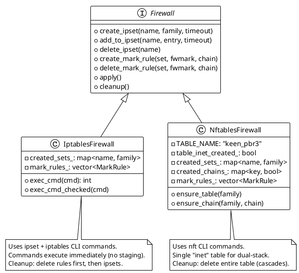

### Backend Detection

```
create_firewall("auto"):
  1. command -v nft    → NftablesFirewall
  2. command -v iptables → IptablesFirewall
  3. Neither found → throw FirewallError
```

### iptables Backend — Shell Commands Executed

| Operation | Shell Command |
|-----------|--------------|
| Create ipset | `ipset create <name> hash:net family <inet\|inet6> [timeout <N>] -exist` |
| Add to ipset | `ipset add <name> <entry> [timeout <N>] -exist` |
| Flush ipset | `ipset flush <name> 2>/dev/null` |
| Destroy ipset | `ipset destroy <name> 2>/dev/null` |
| Create mark rule | `iptables -t mangle -A <chain> -m set --match-set <name> dst -j MARK --set-mark <0xHEX>` |
| Delete mark rule | `iptables -t mangle -D <chain> -m set --match-set <name> dst -j MARK --set-mark <0xHEX> 2>/dev/null` |
| (IPv6 variant) | Replace `iptables` with `ip6tables` |

**Cleanup order**: Delete all mark rules (reverse order) → destroy all ipsets.

### nftables Backend — Shell Commands Executed

| Operation | Shell Command |
|-----------|--------------|
| Create table | `nft add table inet keen_pbr3` |
| Create chain | `nft add chain inet keen_pbr3 <chain> '{ type filter hook prerouting priority mangle; policy accept; }'` |
| Create set | `nft add set inet keen_pbr3 <name> '{ type <ipv4_addr\|ipv6_addr>; flags <interval[, timeout]>; [timeout Ns;] }'` |
| Add element | `nft add element inet keen_pbr3 <name> '{ <entry> [timeout Ns] }'` |
| Create mark rule | `nft add rule inet keen_pbr3 <chain> ip daddr @<name> meta mark set <0xHEX>` |
| Flush set | `nft flush set inet keen_pbr3 <name> 2>/dev/null` |
| Delete set | `nft delete set inet keen_pbr3 <name> 2>/dev/null` |
| Delete rule (by handle) | `handle=$(nft -a list chain inet keen_pbr3 <chain> \| grep '@<name>' \| grep '<0xHEX>' \| sed 's/.*# handle //' \| head -1); if [ -n "$handle" ]; then nft delete rule inet keen_pbr3 <chain> handle $handle; fi` |
| Cleanup (all) | `nft delete table inet keen_pbr3 2>/dev/null` |

**Key differences from iptables**:
- Single `inet` family table handles both IPv4 and IPv6
- Sets use `flags interval` to support both IPs and CIDRs
- Cleanup is a single table delete (cascades to everything)

---

## Health Checking & Circuit Breaker

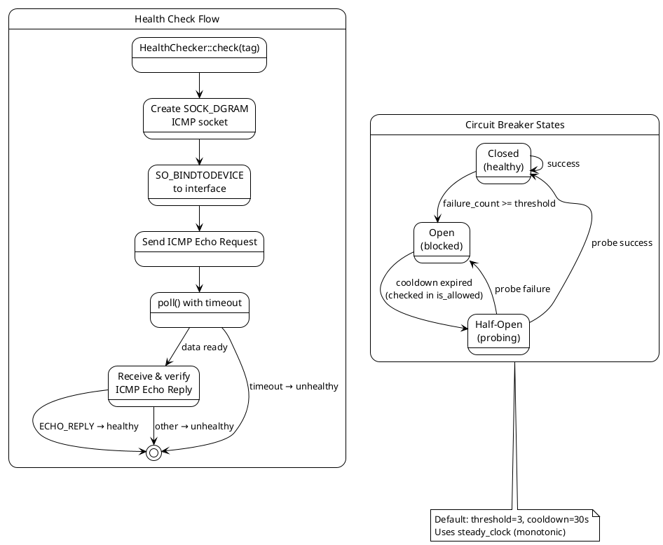

### ICMP Ping Details

- Socket type: `SOCK_DGRAM` (not `SOCK_RAW`) — avoids `CAP_NET_RAW` requirement
- Protocol: `IPPROTO_ICMP` (v4) or `IPPROTO_ICMPV6` (v6)
- Interface binding: `SO_BINDTODEVICE` with interface name + null terminator
- IPv4 ICMP: manual checksum via RFC 1071 algorithm
- IPv6 ICMP: kernel computes checksum
- For `SOCK_DGRAM`, kernel strips IP header — first byte of recv'd data is ICMP header
- `poll()` used for timeout waiting (single fd)

### Health + Circuit Breaker Integration

In `main.cpp`, the health check function used during route resolution combines both:

```
health_fn(tag):
  if circuit_breaker.is_allowed(tag) == false → return false (circuit open)
  if health_checker.has_target(tag) == false → return true (no target = healthy)
  result = health_checker.check(tag) // actual ICMP ping
  record success or failure to circuit_breaker
  return result
```

---

## DNS Routing & Dnsmasq Integration

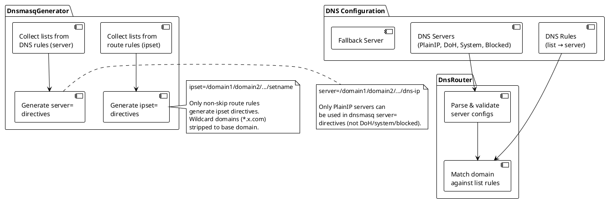

### DNS Server Types

| Type | Address Format | Dnsmasq Support |
|------|---------------|-----------------|
| PlainIP | `"8.8.8.8"`, `"2001:db8::1"` | Yes (`server=` directive) |
| DoH | `"https://dns.google/dns-query"` | No |
| System | `"system"` | No |
| Blocked | `"rcode://refused"` | No |

### Generated Dnsmasq Config Example

```
# Generated by keen-pbr3 - do not edit manually

# List: my-domains
ipset=/example.com/example.org/my-domains
server=/example.com/example.org/10.8.0.1
```

### Domain Matching in DnsRouter

1. For each DNS rule (config order, first match wins):
   - Get the list's parsed domains
   - For each domain in the list:
     - Exact match: `domain == query`
     - Wildcard match: `*.example.com` matches `sub.example.com` AND `example.com` itself
2. If no rule matches → use fallback server

---

## REST API

Compiled only when `with_api` Meson option is `true` (default). Guarded by `#ifdef WITH_API`.

### Architecture

- **cpp-httplib** server runs in a background `std::thread`
- `Server::listen()` is blocking; `Server::stop()` is thread-safe
- Pimpl pattern hides httplib.h from the header
- `ApiContext` holds non-owning references to subsystems

### Endpoints

#### `GET /api/status`

Returns daemon status, version, active outbounds, and loaded list statistics.

```json
{
  "version": "3.0.0",
  "status": "running",
  "outbounds": [
    { "tag": "vpn", "type": "interface", "interface": "tun0", "gateway": "10.8.0.1", "ping_target": "8.8.8.8" },
    { "tag": "block", "type": "blackhole" }
  ],
  "lists": {
    "my-domains": { "ips": 0, "cidrs": 0, "domains": 5 },
    "my-ips": { "ips": 1, "cidrs": 1, "domains": 0 }
  }
}
```

#### `POST /api/reload`

Triggers immediate re-download and refresh of all lists (same as SIGUSR1).

```json
{ "status": "ok", "message": "Reload triggered" }
```

#### `GET /api/health`

Returns health check status for all configured outbounds.

```json
{
  "outbounds": [
    { "tag": "vpn", "type": "interface", "monitored": true, "status": "healthy" },
    { "tag": "wan", "type": "interface", "monitored": false, "status": "healthy" },
    { "tag": "block", "type": "blackhole", "monitored": false, "status": "healthy" }
  ]
}
```

Unmonitored outbounds (no `ping_target`) always report as `"healthy"`.

---

## Shutdown Sequence

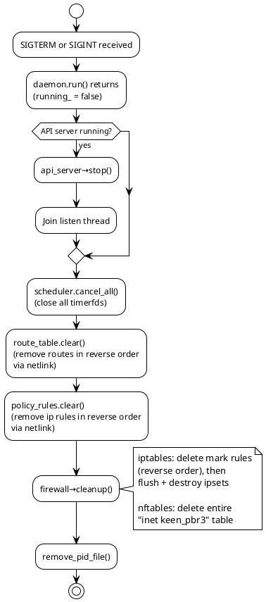

**Shutdown order** (dependencies require this sequence):
1. **API server** — stop accepting requests
2. **Scheduler** — cancel all timers, close timerfds
3. **RouteTable** — remove routes (reverse order via netlink)
4. **PolicyRuleManager** — remove ip rules (reverse order via netlink)
5. **Firewall** — remove mark rules, then ipsets
6. **PID file** — filesystem cleanup

---

## Build System

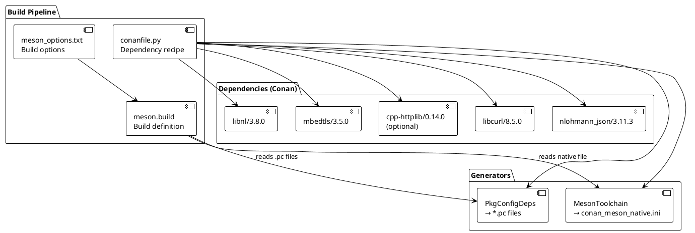

### Meson Build Options

| Option | Type | Default | Description |
|--------|------|---------|-------------|
| `with_api` | boolean | `true` | Include REST API (cpp-httplib) |
| `firewall_backend` | combo | `auto` | `auto`, `iptables`, or `nftables` |

### Compiler Flags

- Standard: C++20
- Optimization: `-Os` (size), `-ffunction-sections`, `-fdata-sections`
- Linker: `-Wl,--gc-sections` (dead code elimination)
- LTO: enabled (`b_lto=true`)
- Cross-builds: `-static` (static linking for embedded deployment)
- API flag: `-DWITH_API` (when `with_api` is true)

### Source Files (22 total)

**Core (20 files):**
```
src/main.cpp
src/config/config.cpp
src/config/list_parser.cpp
src/http/http_client.cpp
src/lists/ipset.cpp
src/lists/list_manager.cpp
src/routing/target.cpp
src/routing/netlink.cpp
src/routing/route_table.cpp
src/routing/policy_rule.cpp
src/health/health_checker.cpp
src/health/circuit_breaker.cpp
src/firewall/firewall.cpp
src/firewall/iptables.cpp
src/firewall/nftables.cpp
src/dns/dns_server.cpp
src/dns/dns_router.cpp
src/dns/dnsmasq_gen.cpp
src/daemon/daemon.cpp
src/daemon/scheduler.cpp
```

**Conditional API (2 files, when `with_api` is true):**
```
src/api/server.cpp
src/api/handlers.cpp
```

---

## Cross-Compilation

### Supported Architectures

| Architecture | Conan Profile | Meson Cross-File | Toolchain Prefix |
|-------------|--------------|-------------------|-----------------|
| MIPS big-endian (OpenWRT) | `mips-be-openwrt` | `mips-be-openwrt.ini` | `mips-openwrt-linux-musl-` |
| MIPS little-endian (OpenWRT) | `mips-le-openwrt` | `mips-le-openwrt.ini` | `mipsel-openwrt-linux-musl-` |
| ARM (OpenWRT) | `arm-openwrt` | `arm-openwrt.ini` | `arm-openwrt-linux-muslgnueabihf-` |
| AArch64 (OpenWRT) | `aarch64-openwrt` | `aarch64-openwrt.ini` | `aarch64-openwrt-linux-musl-` |
| x86_64 (OpenWRT) | `x86_64-openwrt` | `x86_64-openwrt.ini` | `x86_64-openwrt-linux-musl-` |
| MIPS LE (Keenetic) | `mips-le-keenetic` | `mips-le-keenetic.ini` | `mipsel-linux-musl-` |

All profiles use musl libc and include `base-embedded` common settings.

### Build Commands

```bash
# Local build (native)
conan install . --build=missing
meson setup build
meson compile -C build

# Cross-build via Docker
docker build -f docker/Dockerfile.openwrt -t keen-pbr3-builder .
docker run --rm -v "$PWD/dist:/src/dist" keen-pbr3-builder mips-le-openwrt

# Manual cross-build
conan install . --profile:host=conan/profiles/mips-le-openwrt \
                --profile:build=default --output-folder=build/mips-le-openwrt --build=missing
meson setup build/mips-le-openwrt . \
    --cross-file=meson/cross/mips-le-openwrt.ini \
    --native-file=build/mips-le-openwrt/conan_meson_native.ini
meson compile -C build/mips-le-openwrt
```

---

## CI/CD Pipeline

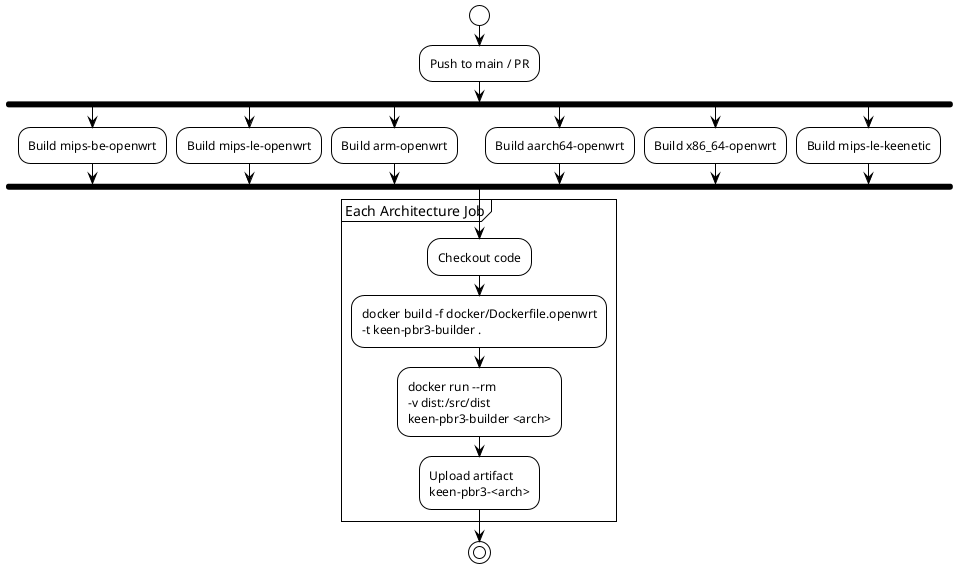

- **Trigger**: Push to `main` or pull request to `main`
- **Strategy**: Matrix build, `fail-fast: false` (one failure doesn't cancel others)
- **Artifacts**: `keen-pbr3-<arch>` binary per architecture
- **Docker image**: Built per-job (no caching between jobs)

---

## File Layout

```
keen-pbr3/
├── include/
│   └── keen-pbr3/
│       └── version.hpp              # Version macros (3.0.0)
├── src/
│   ├── main.cpp                     # Entry point, CLI, subsystem init
│   ├── config/
│   │   ├── config.hpp               # Config structs + parse_config()
│   │   ├── config.cpp               # JSON deserialization (nlohmann_json)
│   │   ├── list_parser.hpp          # ParsedList, ListParser
│   │   └── list_parser.cpp          # IP/domain classification
│   ├── http/
│   │   ├── http_client.hpp          # HttpClient, HttpError
│   │   └── http_client.cpp          # libcurl wrapper
│   ├── lists/
│   │   ├── ipset.hpp                # IpSet, IpTrie (binary trie)
│   │   ├── ipset.cpp                # Trie insert/contains
│   │   ├── list_manager.hpp         # ListManager
│   │   └── list_manager.cpp         # Download, cache, merge
│   ├── routing/
│   │   ├── target.hpp               # RoutingDecision, resolve_route_action()
│   │   ├── target.cpp               # Failover chain resolution
│   │   ├── netlink.hpp              # NetlinkManager, RouteSpec, RuleSpec
│   │   ├── netlink.cpp              # libnl3 route/rule operations
│   │   ├── route_table.hpp          # RouteTable (tracking)
│   │   ├── route_table.cpp          # Add/remove/clear routes
│   │   ├── policy_rule.hpp          # PolicyRuleManager (tracking)
│   │   └── policy_rule.cpp          # Add/remove/clear ip rules
│   ├── firewall/
│   │   ├── firewall.hpp             # Abstract Firewall, factory
│   │   ├── firewall.cpp             # Backend detection, create_firewall()
│   │   ├── iptables.hpp             # IptablesFirewall
│   │   ├── iptables.cpp             # ipset + iptables CLI
│   │   ├── nftables.hpp             # NftablesFirewall
│   │   └── nftables.cpp             # nft CLI
│   ├── health/
│   │   ├── health_checker.hpp       # HealthChecker, HealthResult
│   │   ├── health_checker.cpp       # ICMP ping (SOCK_DGRAM)
│   │   ├── circuit_breaker.hpp      # CircuitBreaker, CircuitState
│   │   └── circuit_breaker.cpp      # State machine
│   ├── dns/
│   │   ├── dns_server.hpp           # DnsServerType, DnsServerConfig
│   │   ├── dns_server.cpp           # Address type detection
│   │   ├── dns_router.hpp           # DnsRouter
│   │   ├── dns_router.cpp           # Domain → DNS server matching
│   │   ├── dnsmasq_gen.hpp          # DnsmasqGenerator
│   │   └── dnsmasq_gen.cpp          # ipset=/server= generation
│   ├── daemon/
│   │   ├── daemon.hpp               # Daemon (epoll + signalfd)
│   │   ├── daemon.cpp               # Event loop
│   │   ├── scheduler.hpp            # Scheduler (timerfd)
│   │   └── scheduler.cpp            # Repeating/oneshot timers
│   └── api/                         # (conditional: WITH_API)
│       ├── server.hpp               # ApiServer (pimpl)
│       ├── server.cpp               # cpp-httplib background thread
│       ├── handlers.hpp             # ApiContext, register_api_handlers()
│       └── handlers.cpp             # GET/POST endpoint handlers
├── conan/
│   └── profiles/
│       ├── base-embedded            # Shared embedded settings
│       ├── mips-be-openwrt          # MIPS big-endian
│       ├── mips-le-openwrt          # MIPS little-endian
│       ├── arm-openwrt              # ARM (armv7hf)
│       ├── aarch64-openwrt          # AArch64
│       ├── x86_64-openwrt           # x86_64
│       └── mips-le-keenetic         # Keenetic MIPS LE
├── meson/
│   └── cross/
│       ├── mips-be-openwrt.ini
│       ├── mips-le-openwrt.ini
│       ├── arm-openwrt.ini
│       ├── aarch64-openwrt.ini
│       ├── x86_64-openwrt.ini
│       └── mips-le-keenetic.ini
├── docker/
│   ├── Dockerfile.openwrt           # Build container (Ubuntu 22.04)
│   └── build.sh                     # Cross-build script
├── .github/
│   └── workflows/
│       └── build.yml                # CI matrix build
├── conanfile.py                     # Conan 2.x recipe
├── meson.build                      # Meson build definition
├── meson_options.txt                # Build options
├── config.example.json              # Example configuration
└── .gitignore
```

---

## External Commands Reference

Complete list of all shell commands the daemon may execute at runtime:

### Firewall Backend Detection

| Command | Purpose |
|---------|---------|
| `command -v nft >/dev/null 2>&1` | Check if nft is available |
| `command -v iptables >/dev/null 2>&1` | Check if iptables is available |

### iptables Backend

| Command | Purpose |
|---------|---------|
| `ipset create <name> hash:net family <inet\|inet6> [timeout <N>] -exist` | Create IP set |
| `ipset add <name> <entry> [timeout <N>] -exist` | Add entry to set |
| `ipset flush <name> 2>/dev/null` | Clear all entries |
| `ipset destroy <name> 2>/dev/null` | Delete set |
| `iptables -t mangle -A PREROUTING -m set --match-set <name> dst -j MARK --set-mark 0x<HEX>` | Create packet mark rule |
| `iptables -t mangle -D PREROUTING -m set --match-set <name> dst -j MARK --set-mark 0x<HEX> 2>/dev/null` | Delete mark rule |
| `ip6tables -t mangle -A PREROUTING -m set --match-set <name> dst -j MARK --set-mark 0x<HEX>` | IPv6 mark rule |
| `ip6tables -t mangle -D PREROUTING -m set --match-set <name> dst -j MARK --set-mark 0x<HEX> 2>/dev/null` | Delete IPv6 mark rule |

### nftables Backend

| Command | Purpose |
|---------|---------|
| `nft add table inet keen_pbr3` | Create dual-stack table |
| `nft add chain inet keen_pbr3 PREROUTING '{ type filter hook prerouting priority mangle; policy accept; }'` | Create prerouting chain |
| `nft add set inet keen_pbr3 <name> '{ type <ipv4_addr\|ipv6_addr>; flags <interval[, timeout]>; [timeout Ns;] }'` | Create set |
| `nft add element inet keen_pbr3 <name> '{ <entry> [timeout Ns] }'` | Add element to set |
| `nft add rule inet keen_pbr3 PREROUTING ip daddr @<name> meta mark set 0x<HEX>` | Create mark rule |
| `nft flush set inet keen_pbr3 <name> 2>/dev/null` | Clear set |
| `nft delete set inet keen_pbr3 <name> 2>/dev/null` | Delete set |
| `nft -a list chain inet keen_pbr3 PREROUTING \| grep ... \| sed ...` | Find rule handle |
| `nft delete rule inet keen_pbr3 PREROUTING handle <N>` | Delete rule by handle |
| `nft delete table inet keen_pbr3 2>/dev/null` | Delete entire table (cleanup) |

### Netlink (kernel API, not shell)

These operations use the **libnl3** C library directly (not shell commands):

| Operation | Kernel Effect |
|-----------|--------------|
| `rtnl_route_add(NLM_F_CREATE\|NLM_F_REPLACE)` | `ip route add/replace default via <gw> dev <iface> table <N>` |
| `rtnl_route_delete()` | `ip route del default table <N>` |
| `rtnl_route_add(RTN_BLACKHOLE)` | `ip route add blackhole default table <N>` |
| `rtnl_rule_add(NLM_F_CREATE\|NLM_F_EXCL)` | `ip rule add fwmark 0x<HEX> table <N> priority <P>` |
| `rtnl_rule_delete()` | `ip rule del fwmark 0x<HEX> table <N>` |

---

## Packet Flow (End-to-End)

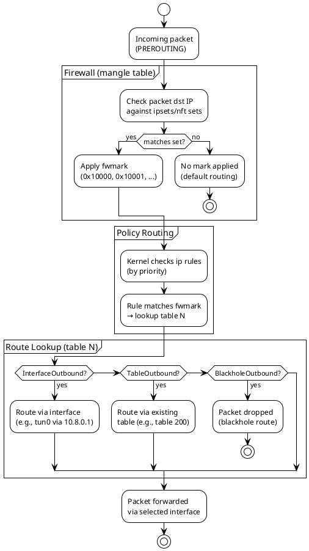

### Domain-Based Flow (via dnsmasq)

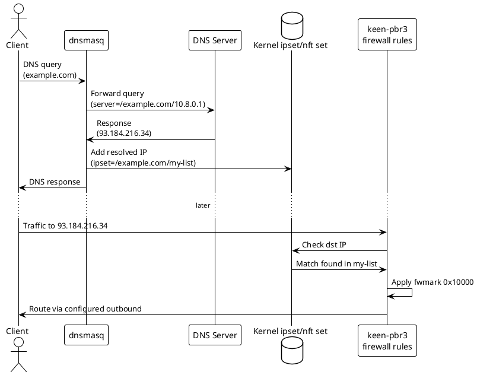
