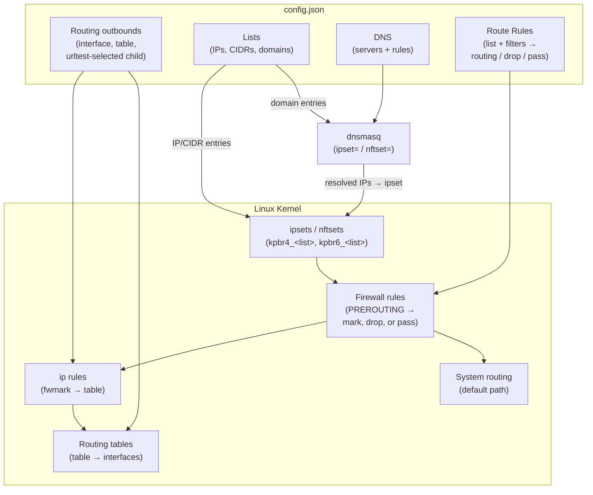
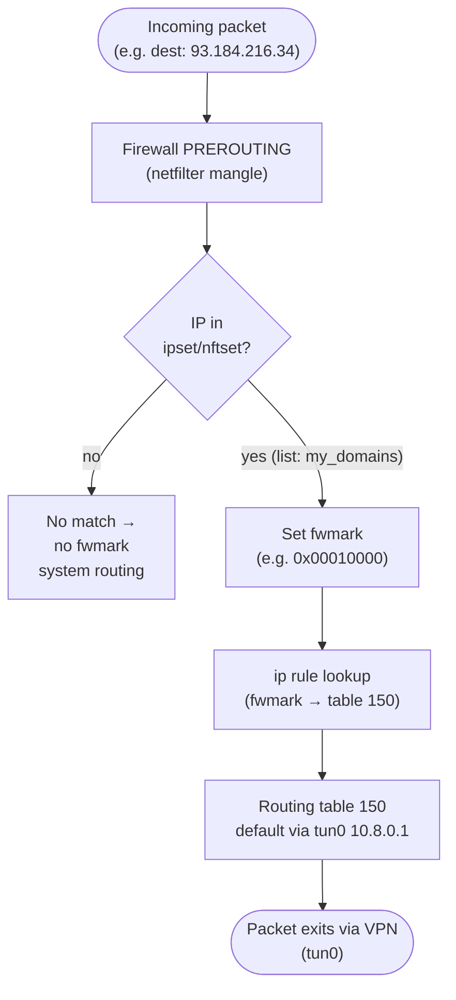
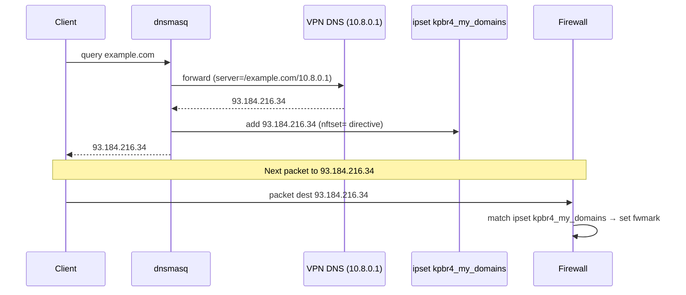

You do not need this page to finish a normal setup.

The short version is simple: you create a list of sites, choose which connection should carry them, and keen-pbr keeps DNS and routing in sync so the right traffic uses the right path.

This page explains what happens under the hood for readers who want the deeper technical model.

## Core Entities

### Lists

Named collections of IPs, CIDRs, and domain names. Sources can be combined freely:
- **Remote URL** (`url`) — downloaded and cached at startup, refreshed on schedule
- **Inline IPs/CIDRs** (`ip_cidrs`) — loaded directly from config
- **Inline domains** (`domains`) — loaded directly from config
- **Local file** (`file`) — read from disk

At startup, IP/CIDR entries are loaded into kernel ipsets or nftsets (`kpbr4_<list>`, `kpbr6_<list>`, no timeout on entries).

Domain entries generate dnsmasq `ipset=`/`nftset=` directives so that when a domain is resolved, its IPs are dynamically added to the matching set (`kpbr4d_<list>`, `kpbr6d_<list>`, entries are timing out after `ttl_ms` configured for domain list).

See [Lists](../configuration/lists/) for the full reference.

### Outbounds

Named egress targets. Five types:

| Type | Description |
|---|---|
| `interface` | Route via a specific network interface and optional IPv4/IPv6 gateways |
| `table` | Defer to an existing kernel routing table |
| `blackhole` | Drop matching traffic |
| `ignore` | Pass through without modification (uses default route) |
| `urltest` | Adaptive selection: probes candidate outbounds by latency, picks the fastest within a tolerance window; includes circuit breaker to prevent flapping |

`interface` and `table` outbounds get fwmarks and policy-routing entries. `urltest` selects among child outbounds that do. `blackhole` becomes a firewall drop rule, and `ignore` becomes a firewall pass-through rule.

When a rule points to `ignore`, keen-pbr installs a matching firewall verdict that stops further keen-pbr rule processing and leaves the packet unmarked. No routing table or `ip rule` is created for that match, so the packet continues through the system's normal routing path. Because route rules are first-match wins, `ignore` is mainly used to carve out exceptions before broader rules below it.

See [Outbounds](../configuration/outbounds/) for the full reference.

### Route Rules

An ordered list of match → action pairs. Each rule can match traffic by:
- **List membership** — IP is in a named ipset/nftset
- **Protocol** (`proto`) — `tcp`, `udp`
- **Port filters** (`src_port`, `dest_port`) — single, list, range, or negation
- **Address filters** (`src_addr`, `dest_addr`) — CIDR, list, or negation

If a rule specifies multiple match fields, a packet must satisfy ALL specified conditions for the rule to match.

First matching rule wins. Unmatched traffic is left unmarked and follows the system's normal routing.

See [Route Rules](../configuration/route-rules/) for the full reference.

### DNS

Maps domain lists to DNS servers via dnsmasq `server=` directives. When a domain in a list is queried, dnsmasq forwards the query to the assigned DNS server. The response IPs are simultaneously injected into the corresponding ipset/nftset so that subsequent packets are routed correctly.

Integration is via `conf-file=` (or `conf-script=`): keen-pbr writes `/tmp/keen-pbr-dnsmasq.conf` on startup; dnsmasq reads it on the next reload.

See [DNS](../configuration/dns/) for the full reference.

---

## How It Works — Startup Sequence

1. **Load lists** — download remote URLs (using cache if unavailable), read local files and inline entries
2. **Populate ipsets/nftsets** — IP/CIDR entries from lists are inserted into kernel sets (`kpbr4_<list>`, `kpbr6_<list>`)
3. **Install firewall rules** — create rules in the `iptables` `mangle` table or the `nftables` `inet KeenPbrTable` table that match configured lists and filters, then set the appropriate fwmark in `PREROUTING` / `prerouting`
4. **Install routing** — create routing tables and `ip rule` entries for each outbound based on assigned fwmarks
5. **Generate resolver config** — write `/tmp/keen-pbr-dnsmasq.conf` with `server=` + `ipset=`/`nftset=` directives; signal dnsmasq to reload
6. **Start urltest probing** — if any `urltest` outbounds are configured, begin periodic latency probes

---

## Architecture Overview

---

## Runtime Packet Flow

---

## DNS Resolution Flow

