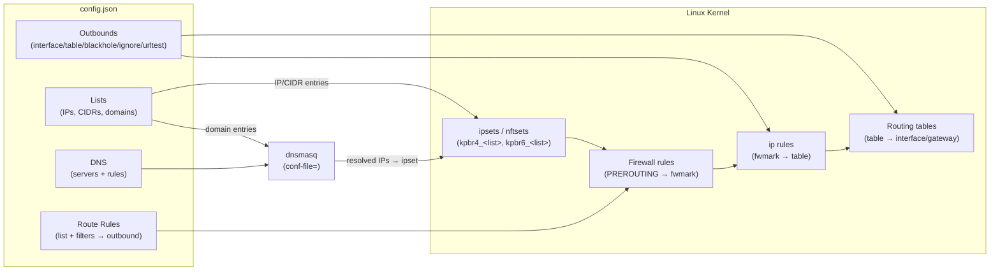
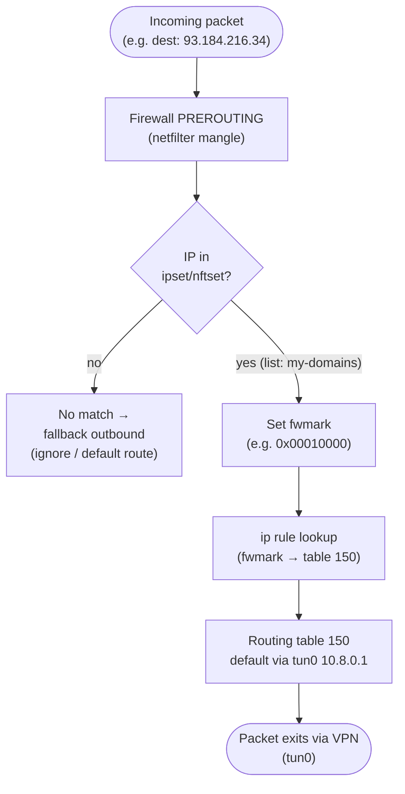
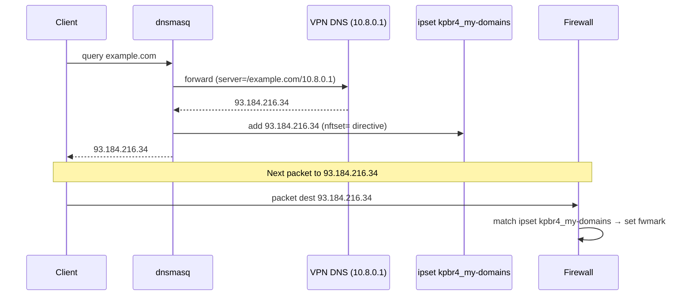

keen-pbr3 orchestrates three Linux kernel subsystems — **netfilter** (firewall), **policy routing** (ip rules + routing tables), and **DNS** (via dnsmasq) — driven by a single JSON config file. This page explains the core entities and how they interact at runtime.

## Core Entities

### Lists

Named collections of IPs, CIDRs, and domain names. Sources can be combined freely:
- **Remote URL** (`url`) — downloaded and cached at startup, refreshed on schedule
- **Inline IPs/CIDRs** (`ip_cidrs`) — loaded directly from config
- **Inline domains** (`domains`) — loaded directly from config
- **Local file** (`file`) — read from disk

At startup, IP/CIDR entries are loaded into kernel ipsets or nftsets (`kpbr4_<list>`, `kpbr6_<list>`). Domain entries generate dnsmasq `ipset=`/`nftset=` directives so that when a domain is resolved, its IPs are dynamically added to the matching set.

See [Lists](configuration/lists/) for the full reference.

### Outbounds

Named egress targets. Five types:

| Type | Description |
|---|---|
| `interface` | Route via a specific network interface and optional gateway |
| `table` | Defer to an existing kernel routing table |
| `blackhole` | Drop matching traffic |
| `ignore` | Pass through without modification (uses default route) |
| `urltest` | Adaptive selection: probes candidate outbounds by latency, picks the fastest within a tolerance window; includes circuit breaker to prevent flapping |

Each outbound gets an fwmark and a routing table entry in the kernel.

See [Outbounds](configuration/outbounds/) for the full reference.

### Route Rules

An ordered list of match → action pairs. Each rule selects traffic by:
- **List membership** — IP is in a named ipset/nftset
- **Protocol** (`proto`) — `tcp`, `udp`
- **Port filters** (`src_port`, `dest_port`) — single, list, range, or negation
- **Address filters** (`src_addr`, `dest_addr`) — CIDR, list, or negation

First matching rule wins. Unmatched traffic goes to the configured `fallback` outbound.

See [Route Rules](configuration/route-rules/) for the full reference.

### DNS

Maps domain lists to DNS servers via dnsmasq `server=` directives. When a domain in a list is queried, dnsmasq forwards the query to the assigned DNS server. The response IPs are simultaneously injected into the corresponding ipset/nftset so that subsequent packets are routed correctly.

Integration is via `conf-file=` (or `conf-script=`): keen-pbr3 writes `/tmp/keen-pbr3-dnsmasq.conf` on startup; dnsmasq reads it on the next reload.

See [DNS](configuration/dns/) for the full reference.

---

## How It Works — Startup Sequence

1. **Load lists** — download remote URLs (using cache if unavailable), read local files and inline entries
2. **Populate ipsets/nftsets** — IP/CIDR entries from lists are inserted into kernel sets (`kpbr4_<list>`, `kpbr6_<list>`)
3. **Install routing** — create routing tables and ip rules for each outbound based on assigned fwmarks
4. **Generate resolver config** — write `/tmp/keen-pbr3-dnsmasq.conf` with `server=` + `ipset=`/`nftset=` directives; signal dnsmasq to reload
5. **Start urltest probing** — if any `urltest` outbounds are configured, begin periodic latency probes

---

## Architecture Overview

---

## Runtime Packet Flow

---

## DNS Resolution Flow

