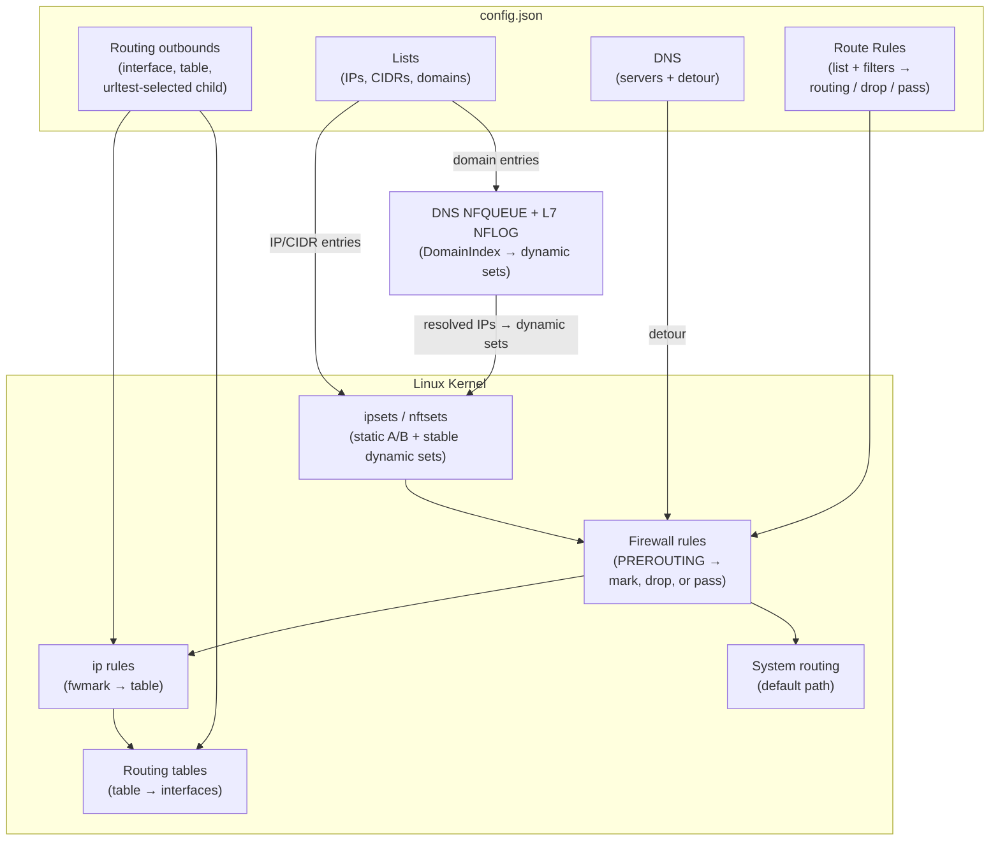
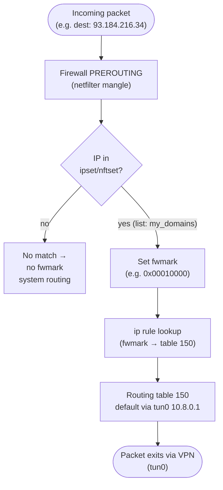
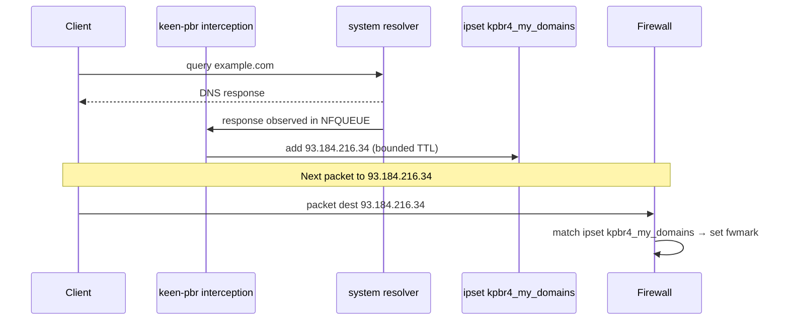

You do not need this page to finish a normal setup.

The short version is simple: you create a list of sites, choose which connection should carry them, and keen-pbr keeps DNS and routing in sync so the right traffic uses the right path.

This page explains what happens under the hood for readers who want the deeper technical model.

## Core Entities

### Lists

Named collections of IPs, CIDRs, and domain names. Sources can be combined freely:
- **Remote URL** (`url`) — downloaded and cached at startup, refreshed on schedule
- **Inline IPs/CIDRs** (`ip_cidrs`) — loaded directly from config
- **Inline domains** (`domains`) — loaded directly from config
- **Local file** (`file`) — read from disk

At startup, IP/CIDR entries are loaded into kernel sets. The iptables backend alternates between `kpbr4s_/kpbr4S_` and `kpbr6s_/kpbr6S_`; nftables keeps stable `kpbr4_`/`kpbr6_` names. Static entries have no timeout.

Domain entries are matched by the DNS/L7 interception service and their
resolved IPs are added to the matching dynamic set (`kpbr4d_<list>`,
`kpbr6d_<list>`) with bounded TTL.

See [Lists]() for the full reference.

### Outbounds

Named egress targets. Five types:

| Type | Description |
|---|---|
| `interface` | Route via a specific network interface and optional IPv4/IPv6 gateways |
| `table` | Defer to an existing kernel routing table |
| `blackhole` | Drop matching traffic |
| `ignore` | Pass through without modification (uses default route) |
| `urltest` | Adaptive selection: probes candidate outbounds by latency, picks the fastest within a tolerance window; includes circuit breaker to prevent flapping |

`interface` and `table` outbounds get fwmarks and policy-routing entries. `urltest` selects among child outbounds that do. `blackhole` becomes a firewall drop rule, and `ignore` becomes a firewall pass-through rule.

When a rule points to `ignore`, keen-pbr installs a matching firewall verdict that stops further keen-pbr rule processing and leaves the packet unmarked. No routing table or `ip rule` is created for that match, so the packet continues through the system's normal routing path. Because route rules are first-match wins, `ignore` is mainly used to carve out exceptions before broader rules below it.

See [Outbounds]() for the full reference.

### Route Rules

An ordered list of match → action pairs. Each rule can match traffic by:
- **List membership** — IP is in a named ipset/nftset
- **Protocol** (`proto`) — `tcp`, `udp`
- **Port filters** (`src_port`, `dest_port`) — single, list, range, or negation
- **Address filters** (`src_addr`, `dest_addr`) — CIDR, list, or negation

If a rule specifies multiple match fields, a packet must satisfy ALL specified conditions for the rule to match.

First matching rule wins. Unmatched traffic is left unmarked and follows the system's normal routing.

See [Route Rules]() for the full reference.

### DNS

keen-pbr does not configure or depend on any resolver (dnsmasq, the Keenetic
DNS proxy or any other keeps working as set up): NFQUEUE parses DNS responses and NFLOG can learn TLS SNI, HTTP Host,
and QUIC Initial names. Matching response IPs are injected into the
corresponding dynamic set so subsequent packets are routed correctly.

Optional [dnsmasq management]() can route domains from specific lists through different DNS servers (useful for CDN region matching).

See [DNS]() for the full reference.
See the [DNS and L7 interception architecture](https://github.com/maksimkurb/keen-pbr/blob/main/docs/dns-interception.md)
for packet flow, capability gating, and failure behavior.

---

## How It Works — Startup Sequence

1. **Load lists** — download remote URLs (using cache if unavailable), read local files and inline entries
2. **Populate ipsets/nftsets** — IP/CIDR entries are inserted into the inactive A/B iptables sets or stable nftables sets
3. **Install firewall rules** — create rules in the `iptables` `mangle` table or the `nftables` `inet KeenPbrTable` table that match configured lists and filters, then set the appropriate fwmark in `PREROUTING` / `prerouting`
4. **Install routing** — create routing tables and `ip rule` entries for each outbound based on assigned fwmarks
5. **Start interception** — attach the DNS NFQUEUE and L7 NFLOG hooks when
   capabilities are available, then publish the DomainIndex and dynamic-set
   snapshot
6. **Start urltest probing** — if any `urltest` outbounds are configured, begin periodic latency probes

---

## Architecture Overview

```mermaid
flowchart TD
    subgraph Config["config.json"]
        RoutingOutbounds["Routing outbounds\n(interface, table,\nurltest-selected child)"]
        Lists["Lists\n(IPs, CIDRs, domains)"]
        DNS["DNS\n(servers + detour)"]
        RouteRules["Route Rules\n(list + filters →\nrouting / drop / pass)"]
    end

    subgraph Kernel["Linux Kernel"]
        Ipsets["ipsets / nftsets\n(static A/B + stable dynamic sets)"]
        FwmarkRules["Firewall rules\n(PREROUTING →\nmark, drop, or pass)"]
        IpRules["ip rules\n(fwmark → table)"]
        RoutingTables["Routing tables\n(table → interfaces)"]
        SystemRouting["System routing\n(default path)"]
    end

    Interceptor["DNS NFQUEUE + L7 NFLOG\n(DomainIndex → dynamic sets)"]

    Lists -->|"IP/CIDR entries"| Ipsets
    Lists -->|"domain entries"| Interceptor
    DNS -->|"detour"| FwmarkRules
    Ipsets --> FwmarkRules
    RouteRules --> FwmarkRules
    RoutingOutbounds --> IpRules
    RoutingOutbounds --> RoutingTables
    FwmarkRules --> IpRules
    FwmarkRules --> SystemRouting
    IpRules --> RoutingTables
    Interceptor -->|"resolved IPs → dynamic sets"| Ipsets
```

---

## Runtime Packet Flow

```mermaid
flowchart TD
    Packet(["Incoming packet\n(e.g. dest: 93.184.216.34)"])
    PREROUTING["Firewall PREROUTING\n(netfilter mangle)"]
    IpsetCheck{"IP in\nipset/nftset?"}
    NoMatch["No match →\nno fwmark\nsystem routing"]
    Fwmark["Set fwmark\n(e.g. 0x00010000)"]
    IpRule["ip rule lookup\n(fwmark → table 150)"]
    RoutingTable["Routing table 150\ndefault via tun0 10.8.0.1"]
    Egress(["Packet exits via VPN\n(tun0)"])

    Packet --> PREROUTING
    PREROUTING --> IpsetCheck
    IpsetCheck -->|"no"| NoMatch
    IpsetCheck -->|"yes (list: my_domains)"| Fwmark
    Fwmark --> IpRule
    IpRule --> RoutingTable
    RoutingTable --> Egress
```

---

## DNS Resolution Flow

```mermaid
sequenceDiagram
    participant Client
    participant Interceptor as keen-pbr interception
    participant Resolver as system resolver
    participant Ipset as ipset kpbr4_my_domains
    participant Firewall

    Client->>Resolver: query example.com
    Resolver-->>Client: DNS response
    Resolver->>Interceptor: response observed in NFQUEUE
    Interceptor->>Ipset: add 93.184.216.34 (bounded TTL)

    Note over Client,Firewall: Next packet to 93.184.216.34
    Client->>Firewall: packet dest 93.184.216.34
    Firewall->>Firewall: match ipset kpbr4_my_domains → set fwmark
```
