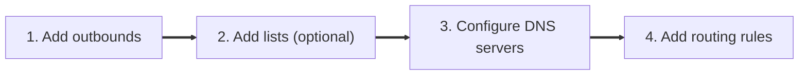

This guide helps you finish a first working setup that sends selected sites through a VPN while everything else keeps using the normal connection.

If you installed the full package, the Web UI is the easiest place to start. If you installed `keen-pbr-headless` or prefer editing files directly, use the JSON / CLI tab.

To complete your minimal installation you will need to configure the following things:







If you have installed `keen-pbr-headless`, see **JSON** configuration method.


<p>
    <figure class="video">
        <video
        controls
        playsinline
        preload="metadata"
        style="width: 100%; border-radius: 12px;"
        >
        <source src="/docs/getting-started/quick-start-video.mp4" type="video/mp4">
        Your browser does not support the video tag.
        </video>
    </figure>
</p>

{}

### Open the Web UI

Open `http://<router-ip>:12121/` in your browser (replace `<router-ip>` with your router IP address).


Tip: On Keenetic / NetCraze you can also open http://my.keenetic.net:12121/.


### Create the outbounds

Go to **Outbounds** and create these two entries:

1. Create a new outbound named `vpn` with the following options:
    - `type = interface`
    - `interface = <your_vpn_interface_name>`
    - `gateway = <your_vpn_gateway_ip>` if your VPN requires an explicit IPv4 gateway
    - `gateway6 = <your_vpn_gateway6_ip>` if your VPN requires an explicit IPv6 gateway

2. Create another outbound named `default` with the following options:
    - `type = Routing table`
    - `Table ID = 254`

#### Why `default`? {class="no-step-marker"}

This example uses the `main` Linux routing table as the fallback path, so `default` should point to routing table `254`.

### Create a test list

Go to **Lists** and create a list such as `my_sites` with type `Domains / IPs`, then add a test domain like `ifconfig.co`.

### Add a routing rule

Go to **Routing rules** and route `my_sites` through the `vpn` outbound.

### Verification

1. Apply the configuration and wait until "draft config" notification disappear.
2. Clear DNS cache on your device:
    - For Windows PC, open Command Prompt and run `ipconfig /flushdns`.
    - For Linux PC, open Terminal and run `sudo resolvectl flush-caches`.
    - For mobile devices just reconnect to your WiFi.
3. Open a website from your list (`ipconfig.co`) and check that IP is differs from the other "my IP" website (e.g. `wtfismyip.com`)

{}

To verify the setup, open a site from your list and make sure it works through the VPN. If you want a command-line check, run:

```bash {filename="bash"}
keen-pbr test-routing ifconfig.co
```

If the result shows your VPN outbound in both the expected and actual columns, the setup is working.




Use this path if you installed `keen-pbr-headless` or prefer editing the config file directly.

Config file locations:

- Keenetic / NetCraze: `/opt/etc/keen-pbr/config.json`
- OpenWrt: `/etc/keen-pbr/config.json`
- Debian: `/etc/keen-pbr/config.json`

Example minimal config:

```json {filename="config.json"}
{
  // Outbounds is where your traffic can go
  "outbounds": [
    {
      "tag": "vpn",          // outbound name, you can use alphanumeric symbols and underscore
      "type": "interface",   // "interface" outbound can route your traffic through specific interface
      "interface": "tun0",
      "gateway": "10.8.0.1"
    },
    {
      "tag": "out",
      "type": "table",  // "table" outbound can route your traffic to the iproute kernel table
      "table": 254      // kernel routing table named "main" has the ID 254. See /etc/iproute2/rt_tables file for more info.
    }
  ],
  "lists": {
    "my_sites": {   // list with inline domains
      "domains": ["ifconfig.co"],
      "ttl_ms": 3600000 // for how long resolved IP should be added into routing ipsets after it was seen in a DNS response, in milliseconds
    },
    "always_out": { // list with inline IPs
      "ip_cidrs": ["120.131.22.11"]
    },
    "my_remote_list": { // remote list
      "url": "https://example.com/my-list.lst",
      "ttl_ms": 0 // if ttl is 0, then IP would be added to ipset forever (until you restart keen-pbr)
    },
    "my_local_file_list": { // local file list
      "file": "/etc/keen-pbr/local.lst"
    }
  },
  "route": {
    "rules": [
      { // All IPs and domains from list "my_sites" will be routed to the "vpn" outbound
        "list": ["my_sites"],
        "outbound": "vpn"
      },
      { // All IPs and domains from list "always_out" will be routed to the "out" outbound
        "list": ["always_out"],
        "outbound": "out"
      }
    ]
  }
}
```

In this example, `out` outbound reuses Linux routing table `main` (that has id `254`).
If you route traffic to this table, it would follow your system default routes.



Set `gateway` only for IPv4. If you also need an explicit IPv6 next-hop, use `gateway6`.
If neither field is set, keen-pbr creates both IPv4 and IPv6 default routes for the interface outbound.


What this example does:

- Creates a VPN outbound and a `out` outbound that reuses routing table `254` (`main` routing table)
- Adds a list called `my_sites` with `ifconfig.co`
- Adds a list called `always_out` with `120.131.22.11`
- Adds lists called `my_remote_list` and `my_local_file_list` that are not used in any rules, but listed here just for example
- Sends DNS lookups for `my_sites` through `vpn_dns`
- Sends traffic for all domains from `my_sites` through `vpn`
- Sends traffic for all IPs from `always_out` through `out`

Restart the service after saving the config:



```bash {filename="bash"}
/opt/etc/init.d/S80keen-pbr restart
```


```bash {filename="bash"}
service keen-pbr restart
```


```bash {filename="bash"}
systemctl restart keen-pbr
```



Verify the result:

```bash {filename="bash"}
keen-pbr test-routing ifconfig.co
```

You can also run `keen-pbr status` for a broader health check.





For the full reference, start with [Configuration]() or jump straight to [Full Reference Config](). If something does not work yet, see [Troubleshooting]().

