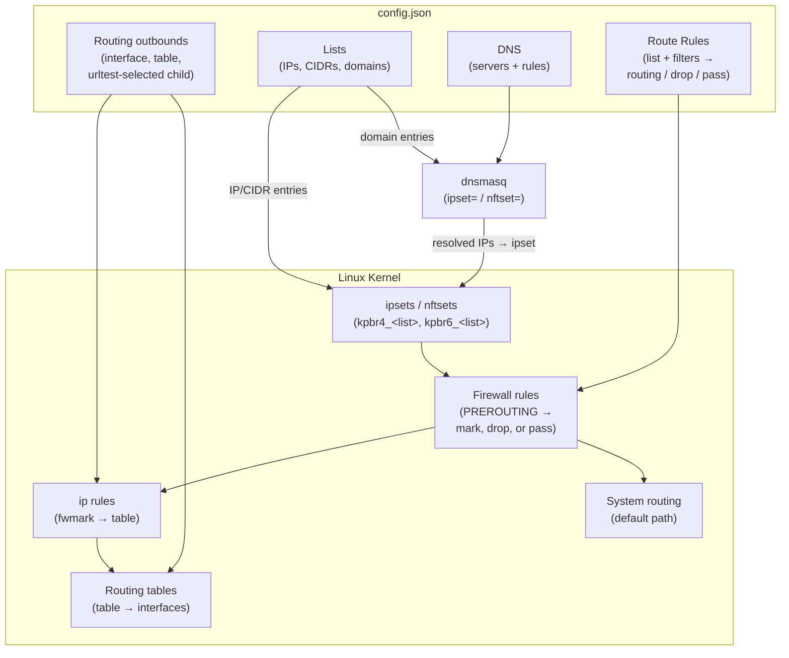
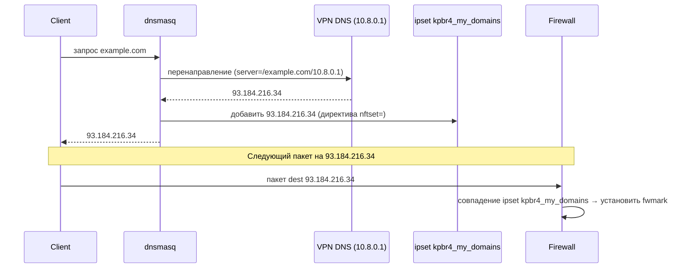

# Концепции

Вам не нужна эта страница для завершения обычной настройки.

Коротко: вы создаёте список сайтов, выбираете какое соединение должно их переносить, и keen-pbr поддерживает DNS и маршрутизацию в синхронизации, чтобы правильный трафик использовал правильный путь.

Эта страница объясняет, что происходит «под капотом» для читателей, которые хотят более глубокую техническую модель.

## Основные сущности

### Списки

Именованные коллекции IP, CIDR и имён доменов. Источники могут свободно комбинироваться:
- **Удалённый URL** (`url`) — загружается и кэшируется при запуске, обновляется по расписанию
- **Встроенные IP/CIDR** (`ip_cidrs`) — загружаются напрямую из конфига
- **Встроенные домены** (`domains`) — загружаются напрямую из конфига
- **Локальный файл** (`file`) — читается с диска

При запуске записи IP/CIDR загружаются в ядерные ipsets или nftsets (`kpbr4_<list>`, `kpbr6_<list>`, без таймаута записей).

Записи доменов генерируют директивы dnsmasq `ipset=`/`nftset=`, чтобы при разрешении домена его IP динамически добавлялись в соответствующий набор (`kpbr4d_<list>`, `kpbr6d_<list>`, записи истекают после `ttl_ms`, настроенного для списка доменов).

См. [Списки](../configuration/lists/) для полного справочника.

### Outbounds

Именованные цели для исходящего трафика. Пять типов:

| Тип | Описание |
|---|---|
| `interface` | Маршрутизация через конкретный сетевой интерфейс и опциональный шлюз |
| `table` | Отложить к существующей таблице маршрутизации ядра |
| `blackhole` | Отбросить соответствующий трафик |
| `ignore` | Пропустить без модификации (использует маршрут по умолчанию) |
| `urltest` | Адаптивный выбор: проверяет кандидаты outbound по задержке, выбирает самый быстрый в пределах допуска; включает circuit breaker для предотвращения флаппинга |

`interface` и `table` outbounds получают fwmarks и записи политической маршрутизации. `urltest` выбирает среди дочерних outbounds. `blackhole` становится правилом отбрасывания firewall, а `ignore` становится правилом пропускания firewall.

Когда правило указывает на `ignore`, keen-pbr устанавливает соответствующий вердикт firewall, который останавливает дальнейшую обработку правил keen-pbr и оставляет пакет немаркированным. Ни таблица маршрутизации, ни `ip rule` не создаются для этого совпадения, поэтому пакет продолжает свой путь через обычную системную маршрутизацию. Поскольку правила маршрутизации первое совпадение выигрывает, `ignore` в основном используется для создания исключений перед более широкими правилами ниже.

См. [Outbounds](../configuration/outbounds/) для полного справочника.

### Правила маршрутизации

Упорядоченный список пар совпадение → действие. Каждое правило может сопоставлять трафик по:
- **Членство в списке** — IP в именованном ipset/nftset
- **Протокол** (`proto`) — `tcp`, `udp`
- **Фильтры портов** (`src_port`, `dest_port`) — одиночный, список, диапазон или отрицание
- **Фильтры адресов** (`src_addr`, `dest_addr`) — CIDR, список или отрицание

Если правило указывает несколько полей совпадения, пакет должен удовлетворять ВСЕМ указанным условиям для сопоставления правила.

Первое совпадшее правило выигрывает. Несопоставленный трафик остаётся немаркированным и следует системной маршрутизации.

См. [Правила маршрутизации](../configuration/route-rules/) для полного справочника.

### DNS

Сопоставляет списки доменов DNS-серверам через директивы dnsmasq `server=`. Когда запрашивается домен в списке, dnsmasq перенаправляет запрос назначенному DNS-серверу. IP-адреса ответа одновременно внедряются в соответствующий ipset/nftset, чтобы последующие пакеты маршрутизировались правильно.

Интеграция через `conf-file=` (или `conf-script=`): keen-pbr записывает `/tmp/keen-pbr-dnsmasq.conf` при запуске; dnsmasq читает его при следующей перезагрузке.

См. [DNS](../configuration/dns/) для полного справочника.

---

## Как это работает — последовательность запуска

1. **Загрузка списков** — загрузка удалённых URL (с использованием кэша, если недоступны), чтение локальных файлов и встроенных записей
2. **Заполнение ipsets/nftsets** — записи IP/CIDR из списков вставляются в ядерные наборы (`kpbr4_<list>`, `kpbr6_<list>`)
3. **Установка правил firewall** — создание правил в таблице `mangle` iptables или таблице `inet KeenPbrTable` nftables, которые сопоставляют настроенные списки и фильтры, затем установка соответствующего fwmark в `PREROUTING` / `prerouting`
4. **Установка маршрутизации** — создание таблиц маршрутизации и записей `ip rule` для каждого outbound на основе назначенных fwmarks
5. **Генерация конфигурации резолвера** — запись `/tmp/keen-pbr-dnsmasq.conf` с директивами `server=` + `ipset=`/`nftset=`; сигнал dnsmasq для перезагрузки
6. **Начало проверок urltest** — если настроены какие-либо outbounds типа `urltest`, начинаются периодические проверки задержки

---

## Обзор архитектуры

---

## Поток пакета во время выполнения

---

## Поток разрешения DNS

