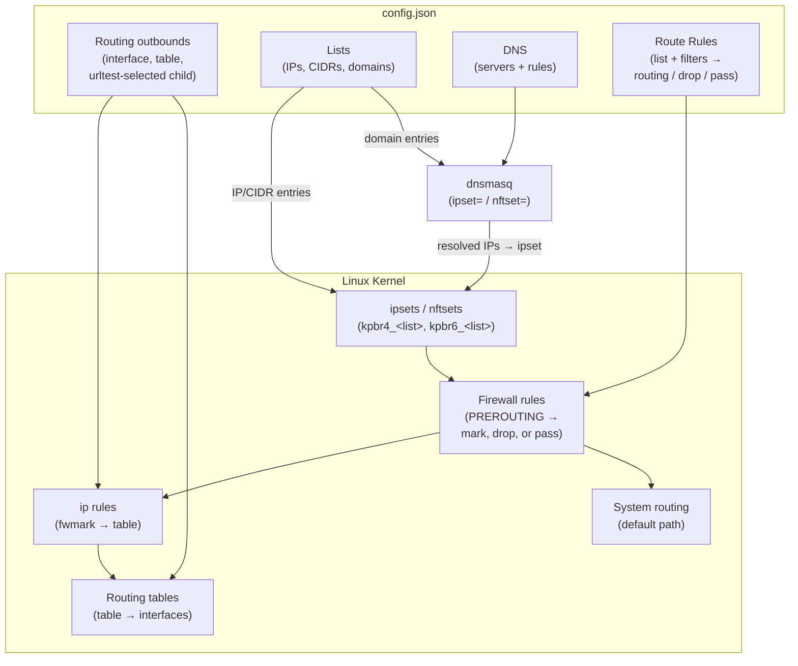
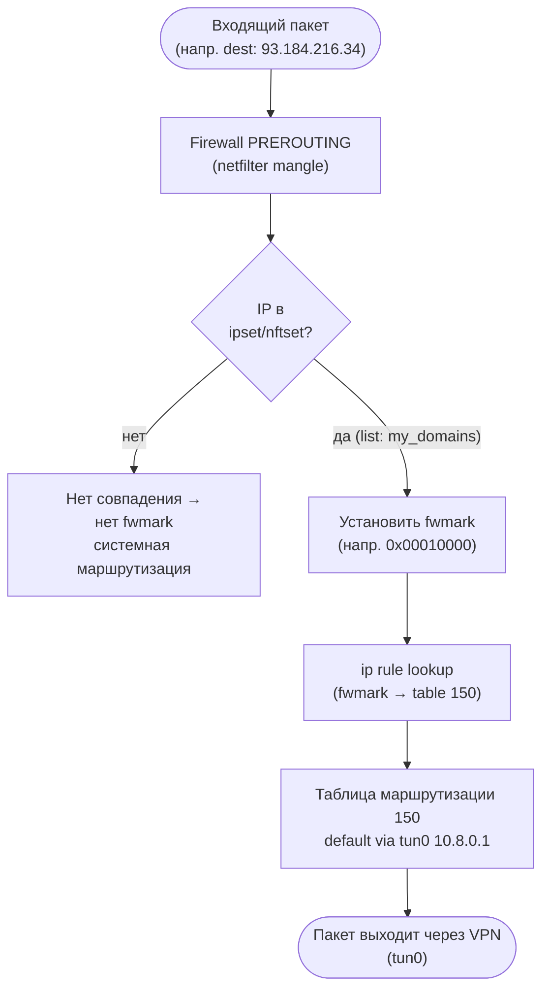
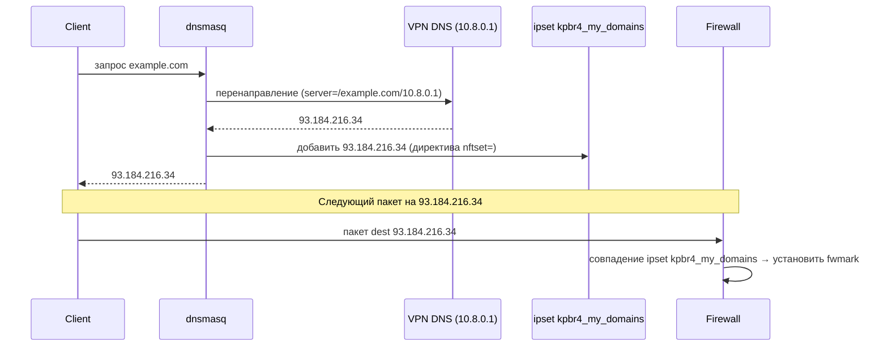

# Принцип работы

Для обычной настройки эту страницу читать необязательно.

Коротко: вы создаёте список сайтов, выбираете, какое соединение должно их обслуживать, а keen-pbr сам следит за тем, чтобы DNS и маршрутизация оставались согласованы и нужный трафик шёл нужным путём.

Эта страница объясняет, что происходит «под капотом», — для тех, кто хочет разобраться глубже.

## Основные сущности

### Списки

Именованные наборы IP-адресов, CIDR-диапазонов и доменных имён. Источники можно комбинировать в любых сочетаниях:
- **Удалённый URL** (`url`) — загружается и кэшируется при запуске, обновляется по расписанию
- **IP/CIDR напрямую** (`ip_cidrs`) — берутся прямо из конфига
- **Домены напрямую** (`domains`) — берутся прямо из конфига
- **Локальный файл** (`file`) — читается с диска

При запуске IP/CIDR-записи загружаются в ipsets или nftsets (`kpbr4_<list>`, `kpbr6_<list>`) без ограничения времени жизни записей.

Домены превращаются в директивы dnsmasq `ipset=`/`nftset=`: при разрешении домена его IP динамически добавляются в соответствующий набор (`kpbr4d_<list>`, `kpbr6d_<list>`) и хранятся там до истечения `ttl_ms`, заданного для этого списка.

См. [Списки](../configuration/lists/) для полного справочника.

### Outbounds

Именованные цели для исходящего трафика. Доступны пять типов:

| Тип | Описание |
|---|---|
| `interface` | Маршрутизация через конкретный сетевой интерфейс с необязательными IPv4/IPv6-шлюзами |
| `table` | Передать трафик в существующую таблицу маршрутизации ядра Linux |
| `blackhole` | Отбросить совпавший трафик |
| `ignore` | Пропустить без изменений (пакет идёт по системной маршрутизации) |
| `urltest` | Адаптивный выбор: проверяет кандидаты по задержке и выбирает наилучший в рамках заданного допуска; включает circuit breaker для предотвращения флаппинга |

Outbounds типа `interface` и `table` получают fwmark и запись в таблице маршрутизации. `urltest` выбирает из дочерних outbounds. `blackhole` создаёт правило сброса пакетов в firewall, `ignore` — правило пропуска.

Когда правило указывает на `ignore`, keen-pbr выставляет вердикт «пропустить» в firewall — дальнейшая обработка правил keen-pbr прекращается, а пакет остаётся без метки. Ни таблица маршрутизации, ни запись `ip rule` для такого совпадения не создаются, поэтому пакет продолжает путь через обычную системную маршрутизацию. Поскольку правила обрабатываются по принципу «первое совпадение побеждает», `ignore` чаще всего применяется для исключений, которые ставятся перед более широкими перехватывающими правилами.

См. [Outbounds](../configuration/outbounds/) для полного справочника.

### Правила маршрутизации

Упорядоченный список пар «условие → действие». Каждое правило может фильтровать трафик по:
- **Принадлежности к списку** — IP входит в именованный ipset/nftset
- **Протоколу** (`proto`) — `tcp`, `udp`
- **Портам** (`src_port`, `dest_port`) — одиночный, список, диапазон или отрицание
- **Адресам** (`src_addr`, `dest_addr`) — CIDR, список или отрицание

Если в правиле указано несколько условий, пакет должен удовлетворять им ВСЕМ.

Срабатывает первое подходящее правило. Трафик, не попавший ни под одно правило, остаётся без метки и идёт через обычную системную маршрутизацию.

См. [Правила маршрутизации](../configuration/route-rules/) для полного справочника.

### DNS

Связывает списки доменов с DNS-серверами через директивы dnsmasq `server=`. Когда запрашивается домен из списка, dnsmasq переадресует запрос назначенному серверу. Полученные IP-адреса одновременно добавляются в соответствующий ipset/nftset, чтобы последующие пакеты шли через правильный outbound.

Интеграция выполняется через `conf-file=` (или `conf-script=`): keen-pbr при запуске записывает файл `/tmp/keen-pbr-dnsmasq.conf`, который dnsmasq читает при следующей перезагрузке.

См. [DNS](../configuration/dns/) для полного справочника.

---

## Как это работает — последовательность запуска

1. **Загрузка списков** — скачиваются удалённые URL (при недоступности берётся кэш), читаются локальные файлы и встроенные записи
2. **Заполнение ipsets/nftsets** — IP/CIDR-записи из списков загружаются в ядерные наборы (`kpbr4_<list>`, `kpbr6_<list>`)
3. **Настройка правил firewall** — в таблице `mangle` iptables или в таблице `inet KeenPbrTable` nftables создаются правила сопоставления по спискам и фильтрам, после чего в `PREROUTING` / `prerouting` проставляются нужные fwmark
4. **Настройка маршрутизации** — под каждый outbound создаются таблица маршрутизации и запись `ip rule` на основе назначенных fwmark
5. **Генерация конфигурации резолвера** — файл `/tmp/keen-pbr-dnsmasq.conf` с директивами `server=` и `ipset=`/`nftset=` записывается на диск; dnsmasq получает сигнал перезагрузки
6. **Запуск urltest-проверок** — если настроены outbounds типа `urltest`, начинаются периодические замеры задержки

---

## Обзор архитектуры

---

## Поток пакета во время выполнения

---

## Поток разрешения DNS

